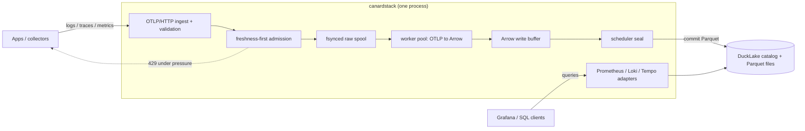

<h1>
  
  canardstack
</h1>

[](https://github.com/smithclay/canardstack/actions/workflows/ci.yml)
[](LICENSE)
[](https://ducklake.select/)
[](https://opentelemetry.io/)
[](https://console.aws.amazon.com/cloudformation/home#/stacks/create/review?stackName=canardstack&templateURL=https%3A%2F%2Fraw.githubusercontent.com%2Fsmithclay%2Fcanardstack%2Fmain%2Fdeploy%2Faws%2Fecs-express%2Ftemplate.yaml)

> OpenTelemetry logs, traces, and metrics stored in DuckLake, visualized in Grafana.

canardstack is an experimental observability backend that stores data in [DuckLake](https://ducklake.select/), an open-standard lakehouse format from the creators of duckdb. Inspired by [ClickStack](https://clickhouse.com/docs/use-cases/observability/clickstack), the project goal is to explore cheap and simple ways to store and query terabytes of observability data *from a single node*.

It accepts OpenTelemetry logs, traces, gauge metrics, and sum metrics over OTLP/HTTP, stores normalized tables in [DuckLake](https://ducklake.select/), and exposes query APIs for Grafana to visualize the data.

Builds on prior work from [otlp2parquet](https://github.com/smithclay/otlp2parquet), [otlp2pipeline](https://github.com/smithclay/otlp2pipeline), and [duckdb-otlp](https://github.com/smithclay/duckdb-otlp).

## Contents

- [Quickstart](#quickstart)
- [Demo](#demo)
- [What You Can Do](#what-you-can-do)
- [Send Telemetry](#send-telemetry)
- [Query Data](#query-data)
- [Use MotherDuck](#use-motherduck)
- [Architecture](#architecture)
- [Operator Notes](#operator-notes)
- [Limits](#limits)
- [For Developers](#for-developers)
- [Documentation](#documentation)

## Quick Start

Install and start canardstack. With no options, it uses local DuckLake storage
under `.canardstack` and listens for OTLP data on `127.0.0.1:4318`.

```bash
# requires rust toolchain: `curl https://sh.rustup.rs -sSf | sh`
# also assumes you have duckdb installed (`brew install duckdb`)
cargo install --locked canardstack
canardstack
```

In another terminal, send one OTLP/HTTP JSON log:

```bash
NOW_NANOS="$(date +%s)000000000"

curl -sS -X POST http://127.0.0.1:4318/v1/logs \
  -H 'Authorization: Bearer dev-canardstack-key' \
  -H 'Content-Type: application/json' \
  --data "{\"resourceLogs\":[{\"scopeLogs\":[{\"logRecords\":[{\"timeUnixNano\":\"$NOW_NANOS\",\"body\":{\"stringValue\":\"hello world\"}}]}]}]}"
```

canardstack acknowledges ingest after the raw request is fsynced locally. Give
the scheduler a moment to sync the log into DuckLake, then query it directly:

```bash
sleep 2
duckdb
```

```sql
INSTALL ducklake;
LOAD ducklake;
ATTACH 'ducklake:.canardstack/canardstack.ducklake' AS canardlake
  (DATA_PATH '.canardstack/storage');
USE canardlake;

SELECT * FROM logs;
```

## Demo

Run canardstack against the full
[OpenTelemetry demo](https://github.com/open-telemetry/opentelemetry-demo).
Keep the demo in a separate checkout; this repo only supplies the collector
extras file that points the demo collector at canardstack.

In the canardstack checkout, start canardstack and the bundled Grafana
datasources:

```bash
cd canardstack
docker compose up --build canardstack grafana
```

This publishes canardstack on `http://localhost:4318` with the default demo key
`dev-canardstack-key`. Grafana is available on `http://localhost:3000`.

In a separate checkout, start the full OpenTelemetry demo and mount the
canardstack collector extras file:

```bash
git clone https://github.com/open-telemetry/opentelemetry-demo.git ../opentelemetry-demo
cd ../opentelemetry-demo

CANARDSTACK_DIR="$(cd ../canardstack && pwd)"
DEMO_VERSION="$(sed -n 's/^IMAGE_VERSION=//p' .env)"

OTEL_COLLECTOR_CONFIG_EXTRAS="$CANARDSTACK_DIR/config/otel-demo-collector-extras.yml" \
DEMO_VERSION="$DEMO_VERSION" \
docker compose up -d
```

`DEMO_VERSION="$DEMO_VERSION"` keeps the demo images aligned with the checked-out
demo config. Without that, some demo checkouts may combine older config files
with newer `latest-*` images.

Open the demo storefront:

```text
http://localhost:8080/
```

The demo load generator starts with the stack and sends logs, traces, and
metrics through the demo collector. The checked-in extras file adds an
`otlphttp/canardstack` exporter to the demo's logs, traces, and metrics
pipelines, using OTLP/HTTP protobuf to `http://host.docker.internal:4318`.

Check that canardstack is receiving the demo:

```bash
curl -sS -H 'x-api-key: dev-canardstack-key' http://127.0.0.1:4318/metrics \
  | grep 'canardstack_ingest_requests_total'
```

You should see accepted `logs`, `traces`, and `metrics` counters climbing. Gauge
and sum metrics are stored; histogram and exponential histogram datapoints are
intentionally rejected in v0, so `canardstack_ingest_unsupported_histograms_total`
is expected to increase during the demo.

Useful query checks after the scheduler has sealed a few batches:

```bash
curl -sS -H 'x-api-key: dev-canardstack-key' \
  http://127.0.0.1:4318/loki/api/v1/label/service_name/values

curl -sS -H 'x-api-key: dev-canardstack-key' \
  http://127.0.0.1:4318/api/search/tags
```

Open the canardstack Grafana dashboard:

```text
http://localhost:3000/d/canardstack-overview/canardstack-overview
```

If you only want the smaller built-in smoke workload instead of the full
OpenTelemetry demo, run the deterministic smoke check from the canardstack
checkout:

```bash
cd ../canardstack
docker compose run --rm smoke
```

The smoke command sends logs, a multi-span trace, gauge samples, and cumulative
sum samples over OTLP/HTTP, then checks storage health plus the Prometheus,
Loki, and Tempo-compatible query paths.

To stop the demo and canardstack:

```bash
cd ../opentelemetry-demo
docker compose down

cd ../canardstack
docker compose down
```

Notes:

- `host.docker.internal` works out of the box on Docker Desktop and OrbStack. On
  plain Linux Docker Engine, use an equivalent host-gateway address or add a
  host alias for the demo collector.
- The extras file keeps the demo's Jaeger, Prometheus, and OpenSearch exporters
  enabled, but narrows the metrics receivers to OTLP and spanmetrics for local
  portability.
- Use `admin/admin` if you log in to the bundled Grafana directly.

## What You Can Do

Use canardstack to:

- Receive OTLP/HTTP logs, traces, gauge metrics, and sum metrics.
- Store normalized telemetry in DuckLake-backed DuckDB tables.
- Inspect data in Grafana through Prometheus, Loki, and Tempo-compatible APIs.
- Query the same DuckLake data directly from DuckDB, MotherDuck, or another SQL
  client.
- Run local experiments with a single Rust binary and one DuckDB process.

canardstack is best suited for local, single-tenant, or experimental deployments
where the operator wants direct access to lakehouse telemetry data and can
accept the current v0 durability and compatibility limits.

## Send Telemetry

canardstack accepts the standard OTLP/HTTP paths:

- `POST /v1/logs`
- `POST /v1/traces`
- `POST /v1/metrics`

For an OpenTelemetry Collector, point an `otlphttp` exporter at canardstack:

```yaml
exporters:
  otlphttp/canardstack:
    endpoint: http://localhost:4318
    headers:
      Authorization: Bearer dev-canardstack-key
```

Route traces, logs, and metrics through that exporter:

```yaml
service:
  pipelines:
    traces:
      receivers: [otlp]
      exporters: [otlphttp/canardstack]
    logs:
      receivers: [otlp]
      exporters: [otlphttp/canardstack]
    metrics:
      receivers: [otlp]
      exporters: [otlphttp/canardstack]
```

For a local proof without changing an app, use the bundled smoke workload:

```bash
docker compose run --rm smoke
```

## Query Data

The v0 query API is a set of bounded compatibility adapters over the stored
telemetry tables.

- Metrics: Prometheus-shaped endpoints for Grafana and simple API clients.
- Logs: Loki-shaped endpoints for label discovery, log queries, and Grafana.
- Traces: Tempo-shaped endpoints for trace lookup and Grafana.
- SQL: direct DuckDB/MotherDuck access outside the HTTP API.

The compatibility APIs are intentionally limited. They are useful for Grafana
inspection, not a complete PromQL, LogQL, TraceQL, Prometheus, Loki, or Tempo
replacement.

Direct SQL is intentionally outside canardstack's HTTP product surface. Use the
DuckDB CLI, MotherDuck, or another SQL client when you want to work with the
underlying DuckLake tables.

## Use MotherDuck

[MotherDuck](https://motherduck.com) has a hosted DuckLake path that is useful
for remote-storage experiments. You can also host DuckLake yourself on a cloud
platform such as
[AWS](https://github.com/danielbeach/DuckLakeonS3andPostgres) or
[Cloudflare](https://github.com/tobilg/cloudflare-ducklake).

After signing up for MotherDuck:

1. Log in to `https://app.motherduck.com/`.
2. Create a new database and choose `DuckLake` under `Advanced`.
3. Copy the connection string for your DuckLake database, usually
   `md:your-database-name`.
4. Create a Read/Write token under MotherDuck Account Settings > Access Tokens.

Set your MotherDuck token and DuckLake attach URI:

```bash
export MOTHERDUCK_TOKEN='<your-motherduck-token>'
export CANARDSTACK_DUCKLAKE_ATTACH_URI='md:test-ducklake'
```

Then start canardstack and Grafana:

```bash
docker compose up --build
```

The canardstack container uses your `CANARDSTACK_DUCKLAKE_ATTACH_URI` and
`MOTHERDUCK_TOKEN` for storage. Grafana stays local and queries canardstack
through the provisioned Prometheus, Loki, and Tempo-compatible datasources.

## Architecture

canardstack is one synchronous Rust process backed by one DuckDB process. It
accepts OTLP over HTTP, normalizes telemetry into Arrow record batches, commits
immutable Parquet segments through DuckLake, and serves bounded compatibility
query APIs over the same tables.



### The write path

Every telemetry request crosses a fixed sequence of boundaries on its way to
queryable storage:

1. **Receive and validate.** Ingest checks auth, content type, body size, and
   compression on the OTLP/HTTP request.
2. **Admit.** Freshness-first admission projects how far behind the seal pipeline
   is, in seconds of expected query-visibility delay. If accepting the request
   would push that projection past the configured freshness budget, it is
   rejected with `429` *before anything is written*.
3. **Spool.** The raw request is appended to a local fsynced raw spool,
   partitioned by request kind (logs / traces / metrics). Once it is durably on
   disk, canardstack returns `2xx`. This is the durability point — not commit,
   not query-visibility.
4. **Transform.** A pool of worker threads decompresses and normalizes the
   payload through `otlp2records` into Arrow record batches, one per storage
   table. A metrics request fans out into both the `metric_gauge` and
   `metric_sum` tables.
5. **Buffer.** Batches accumulate in an in-memory Arrow write buffer. Each row
   keeps a reference back to its raw-spool record so it can be checkpointed once
   it is safely stored.
6. **Seal.** A single scheduler thread flushes the buffer on a size or age
   trigger: it appends the buffered rows and commits one immutable Parquet
   segment per table through DuckLake, then checkpoints the raw-spool records it
   just committed.

The commit-then-checkpoint order is deliberate. canardstack commits to DuckLake
*before* it checkpoints the spool, so a crash in between replays those records on
restart rather than losing them. Delivery is at-least-once; v0 does not
deduplicate replayed rows.

### The read path

Grafana, curl, and other clients query through bounded Prometheus-, Loki-, and
Tempo-shaped adapters that translate into guarded reads over the DuckLake tables.
Queries use a separate DuckDB connection from the writer, so the read path stays
responsive while a seal is in flight. For anything the adapters do not cover, the
same tables are open to direct DuckDB or MotherDuck SQL.

The architecture is intentionally narrow:

- one binary, `canardstack`
- synchronous std-library HTTP server
- no async runtime
- no OTLP/gRPC endpoint
- no Kafka or separate hot store
- one scheduler and single writer

## Operator Notes

| Area | V0 behavior |
| --- | --- |
| Process model | One synchronous Rust binary, one DuckDB process, no async runtime. |
| Ingest | OTLP/HTTP JSON and protobuf for logs, traces, gauge metrics, and sum metrics. |
| Durability | A `2xx` ingest response means the raw request was fsynced to the local spool and accepted for bounded processing. It does not mean rows are committed to DuckLake or query-visible yet. |
| Backpressure | Ingest admission returns `429` under pressure. Storage dependency failures surface as `503`. |
| Storage | DuckLake-backed DuckDB tables. Local DuckLake is the default quickstart path; MotherDuck and Postgres-catalog DuckLake are supported paths. |
| Query | Compatibility subsets with server-side time range, row limit, timeout, memory, and concurrency guards. |
| UI | Grafana only. canardstack does not serve a custom browser UI. |
| Retention | Whole-day retention on telemetry tables, followed by DuckLake cleanup hooks when attached. |

Configuration is available through `config.toml` and `CANARDSTACK_*`
environment variables. Start from `config/example.toml` for structured config
or `config/example.env` for host development. Environment variables override
the file. Set `CANARDSTACK_CONFIG=/path/to/config.toml` to load a different
config file.

Diagnostics are logfmt-style structured events on stderr. Set
`CANARDSTACK_LOG=debug` or use `RUST_LOG` to adjust verbosity.

## Limits

canardstack is experimental and not production-ready.

Known v0 limits:

- Current single-node throughput is bounded by raw-spool append and backlog
  behavior. On May 20, 2026, the highest clean 10-minute mixed-signal run was
  `2000 GB/day` with `--ingest-concurrency 64` (`23.1 MB/s` accepted decoded
  throughput, no `429`/`503` or query failures). A `2500 GB/day` mixed run
  reached Vector-like log event rates briefly, but failed the 10-minute
  guardrail with `429` queue-pressure responses after roughly eight minutes.
- No exactly-once ingest acknowledgement. A crash after `2xx` should replay a
  fsynced raw-spool record if it was not checkpointed, but duplicate replay can
  occur when storage commit succeeds before raw-spool checkpoint.
- No OTLP/gRPC endpoint. Use an OpenTelemetry Collector if your clients need
  gRPC.
- No histograms or exponential histograms.
- No multi-tenancy.
- No full PromQL, LogQL, TraceQL, Prometheus, Loki, or Tempo implementation.
- No arbitrary SQL through compatibility APIs.
- No sub-second freshness target.

## For Developers

Contributor setup and implementation details live in
[docs/developer.md](docs/developer.md). Start there when changing canardstack
itself.

Common local checks:

```bash
cargo check
cargo test
cargo fmt --all -- --check
cargo clippy --all-targets --all-features --locked -- -D warnings
```

Host run workflow:

```bash
cp config/example.env .env
set -a
. ./.env
set +a
cargo run -- serve
```

Then run an in-process smoke test:

```bash
cargo run -- smoke
```

Keep changes scoped, preserve the synchronous single-binary architecture, and
add or update tests for behavior changes when practical.

## Documentation

- [Developer guide](docs/developer.md)
- [V0 architecture](docs/architecture/v0-architecture.md)
- [Storage schema](docs/architecture/storage-schema.md)
- [Query API](docs/architecture/query-api.md)
- [Operator metrics](docs/architecture/operator-metrics.md)
- [Benchmarking](docs/BENCHMARKING.md)
- [Benchmark gates](docs/planning/benchmark.md)
- [Failure runbooks](docs/runbooks/failure-runbooks.md)

## Acknowledgements

Thanks to @hanorigins, Tyler Hillery, and @decalek from the DuckDB Discord for
starting a discussion that led to this proof of concept.
