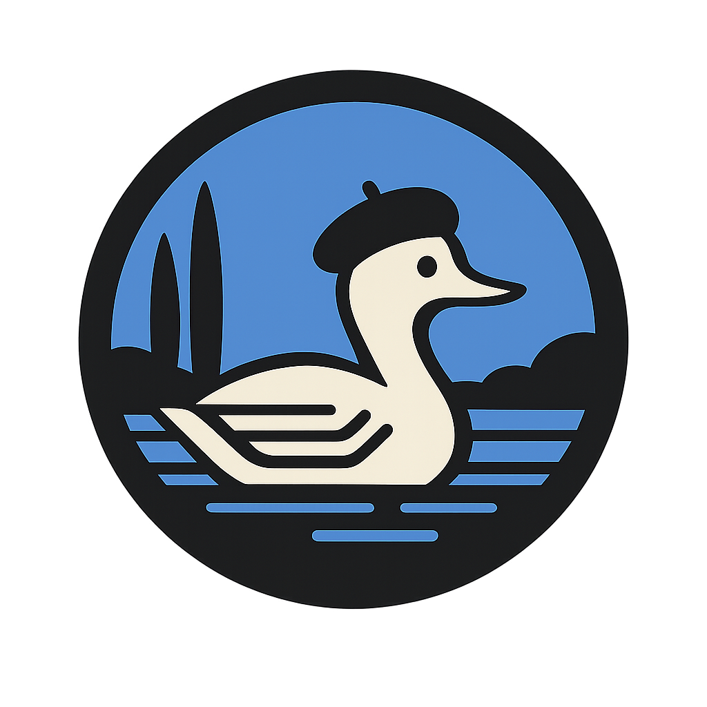
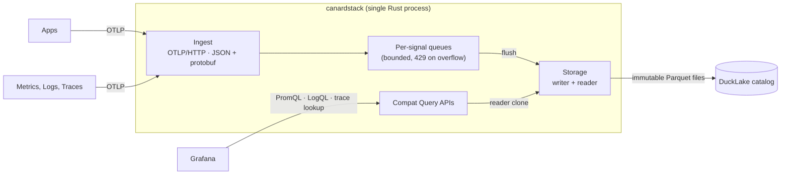

<h1>
  
  canardstack
</h1>


[](https://github.com/smithclay/canardstack/actions/workflows/ci.yml)
[](LICENSE)
[](https://ducklake.select/)
[](https://opentelemetry.io/)

> OpenTelemetry metrics, logs, and traces stored in DuckLake. Inspect them with
> Grafana or DuckDB-compatible tools.

canardstack is an experimental single-tenant observability backend powered by
[DuckLake](https://ducklake.select/), an open lakehouse format built on DuckDB,
Parquet, and object storage.

It accepts OpenTelemetry logs, traces, gauge metrics, and sum metrics over
OTLP/HTTP. It stores normalized tables in DuckLake and exposes small
Prometheus-, Loki-, and Tempo-shaped query surfaces for Grafana, curl, and
other protocol-compatible clients.

It is not a full observability suite. It is a small backend for operators who
want telemetry in DuckLake/DuckDB-accessible tables, with enough compatibility
surface to inspect the data through familiar tools.

Builds on prior work from [otlp2parquet](https://github.com/smithclay/otlp2parquet), [otlp2pipeline](https://github.com/smithclay/otlp2pipeline), and [duckdb-otlp](https://github.com/smithclay/duckdb-otlp).

## Contents

- [Quickstart: Local DuckLake](#quickstart-local-ducklake)
- [Quickstart: MotherDuck-hosted DuckLake](#quickstart-motherduck-hosted-ducklake)
- [Who It Is For](#who-it-is-for)
- [Architecture](#architecture)
- [Send Telemetry](#send-telemetry)
- [Query Data](#query-data)
- [Operator Contract](#operator-contract)
- [Caveats](#caveats)
- [Documentation](#documentation)

## Quickstart: Local DuckLake

Start canardstack and Grafana with local DuckLake storage:

```bash
docker compose up --build
```

Docker Compose runs canardstack on `http://localhost:4318` and Grafana on
`http://localhost:3000`. Local DuckLake metadata and data files live in the
`canardstack-data` Docker volume.

Seed representative telemetry through the running service:

```bash
docker compose run --rm smoke
```

The smoke command sends a small multi-service demo workload over OTLP/HTTP:
logs, a multi-span trace, gauge samples, and cumulative sum samples. It then
verifies storage health plus the Prometheus, Loki, and Tempo-compatible query
paths.

Open the provisioned canardstack Grafana dashboard:

```text
http://localhost:3000/d/canardstack-overview/canardstack-overview
```

Grafana is the bundled UI. It is provisioned with canardstack datasources, and
the default dashboard shows the smoke workload alongside canardstack's stored
self-metrics. Use `admin/admin` if you log in directly.

## Quickstart: MotherDuck-hosted DuckLake

[MotherDuck](https://motherduck.com) has a hosted DuckLake path that is useful
for fast remote-storage experiments. You can also host DuckLake yourself on a
cloud platform such as
[AWS](https://github.com/danielbeach/DuckLakeonS3andPostgres) or
[Cloudflare](https://github.com/tobilg/cloudflare-ducklake).

After signing up for MotherDuck:

- Log in to https://app.motherduck.com/, create a new database and under "Advanced" choose "DuckLake"
- Copy the connection string for your DuckLake database, usually `md:your-database-name`
- Under MotherDuck Account Settings > Access Tokens, create a new Read/Write token

Set your MotherDuck token and the remote DuckLake connection string:

```bash
export MOTHERDUCK_TOKEN='<your-motherduck-token>'
export CANARDSTACK_DUCKLAKE_ATTACH_URI='md:test-ducklake'
```

Start local canardstack and Grafana against the MotherDuck-hosted DuckLake:

```bash
docker compose up --build
```

Docker Compose runs canardstack on `http://localhost:4318` and Grafana on
`http://localhost:3000`. The canardstack container uses your
`CANARDSTACK_DUCKLAKE_ATTACH_URI` and `MOTHERDUCK_TOKEN` for storage, while the
Grafana container stays local and queries canardstack through the provisioned
Prometheus, Loki, and Tempo-compatible datasources.

In another terminal, seed representative telemetry through the local
canardstack service:

```bash
docker compose run --rm smoke
```

Then open the local Grafana overview dashboard:

```text
http://localhost:3000/d/canardstack-overview/canardstack-overview
```

Grafana is the bundled UI. It is provisioned with canardstack datasources based
on Prometheus, Loki, and Tempo APIs. The default dashboard shows the smoke
workload alongside canardstack's stored self-metrics. Use `admin/admin` for
logging on.

## Who It Is For

canardstack is for:

- Operators curious about DuckLake as an observability storage layer.
- Teams that want OTLP data in queryable DuckDB/DuckLake tables.
- Local or single-tenant deployments where bounded loss is acceptable.

canardstack is not for:

- Production systems that require durable ingest acknowledgement.
- Multi-tenant observability platforms.
- Full Prometheus, Loki, Tempo, PromQL, LogQL, or TraceQL compatibility.
- OTLP/gRPC ingest without an OpenTelemetry Collector translating to
  OTLP/HTTP.
- Teams that want a polished all-in-one observability UI, alerting product, or
  session replay system.

## Architecture

A single Rust process accepts OTLP over HTTP and normalizes records into
per-signal tables in DuckLake. Separately, Prometheus-, Loki-, and Tempo-shaped
APIs are available over the same store so Grafana can visualize the data without
a custom plugin.



## Send Telemetry

Configure an OTLP/HTTP exporter to forward data to the canardstack endpoint.
canardstack accepts the standard OTLP/HTTP paths:

- `POST /v1/logs`
- `POST /v1/traces`
- `POST /v1/metrics`

For an OpenTelemetry Collector, point an `otlphttp` exporter at the same port:

```yaml
exporters:
  otlphttp/canardstack:
    endpoint: http://localhost:4318
    headers:
      Authorization: Bearer dev-canardstack-key
```

Route traces, logs, and metrics through that exporter in the collector's
pipelines:

```yaml
service:
  pipelines:
    traces:
      receivers: [otlp]
      exporters: [otlphttp/canardstack]
    logs:
      receivers: [otlp]
      exporters: [otlphttp/canardstack]
    metrics:
      receivers: [otlp]
      exporters: [otlphttp/canardstack]
```

For a local proof without changing an app, Docker Compose can send a sample log,
trace, gauge metric, and sum metric:

```bash
docker compose run --rm smoke
```

## Query Data

The v0 query API is a set of compatibility adapters over the internal query
engine based on Prometheus, Loki, and Tempo APIs.

This makes it possible to use Grafana without custom plugins to visualize and
query metrics, logs, and traces stored in DuckDB/DuckLake.

Power users can query the same DuckLake/DuckDB data directly through DuckDB CLI,
MotherDuck, or SQL clients.

## Operator Contract

| Area | V0 behavior |
| --- | --- |
| Process model | One synchronous Rust binary, one DuckDB process, no async runtime. |
| Ingest | OTLP/HTTP JSON and protobuf for logs, traces, gauge metrics, and sum metrics. |
| Backpressure | Bounded queues return `429` under pressure. Storage dependency failures surface as `503`. |
| Durability | A `2xx` ingest response means accepted into bounded process memory. It does not mean committed to DuckLake. |
| Storage | DuckLake-backed DuckDB tables by default. Local DuckLake is the quickstart path; MotherDuck and Postgres-catalog DuckLake are supported paths. |
| Query | Prometheus, Loki, and Tempo compatibility subsets with server-side time range, row limit, timeout, memory, and concurrency guards. |
| SQL | Direct SQL is intentionally outside the HTTP product surface. Use DuckDB CLI, MotherDuck, or another SQL client. |
| UI | Grafana only. There is no custom canardstack web UI. |
| Retention | Whole-day retention on telemetry tables, followed by DuckLake cleanup hooks when attached. |

## Caveats

canardstack is experimental and not production-ready.

Known v0 limits:

- No durable ingest WAL. A crash can lose accepted but unflushed telemetry.
- No OTLP/gRPC endpoint. Use an OpenTelemetry Collector if your clients need
  gRPC.
- No histograms or exponential histograms.
- No multi-tenancy.
- No full PromQL, LogQL, TraceQL, Prometheus, Loki, or Tempo implementation.
- No arbitrary SQL through compatibility APIs.
- No sub-second freshness target.

## Acknowledgements

@hanorigins, Tyler Hillery, @decalek from the duckdb discord for starting a discussion that lead to this proof-of-concept.

## Documentation

- [Developer guide](docs/developer.md)
- [V0 architecture](docs/architecture/v0-architecture.md)
- [Storage schema](docs/architecture/storage-schema.md)
- [Query API](docs/architecture/query-api.md)
- [Operator metrics](docs/architecture/operator-metrics.md)
- [Benchmark gates](docs/planning/benchmark.md)
- [Failure runbooks](docs/runbooks/failure-runbooks.md)
