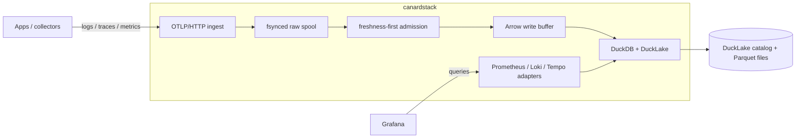

<h1>
  
  canardstack
</h1>

[](https://github.com/smithclay/canardstack/actions/workflows/ci.yml)
[](LICENSE)
[](https://ducklake.select/)
[](https://opentelemetry.io/)

> OpenTelemetry logs, traces, and metrics stored in DuckLake. Inspect them with
> Grafana or DuckDB-compatible tools.

canardstack is an experimental, single-tenant observability backend for people
who want telemetry in DuckLake/DuckDB-accessible tables.

It accepts OpenTelemetry logs, traces, gauge metrics, and sum metrics over
OTLP/HTTP, stores normalized tables in [DuckLake](https://ducklake.select/),
and exposes small Prometheus-, Loki-, and Tempo-shaped query APIs for Grafana,
curl, and other compatible clients.

It is not a full observability suite. There is no custom UI, no alerting
system, no multi-tenancy, and no full Prometheus, Loki, or Tempo implementation.
The goal is a small backend that makes OpenTelemetry data easy to land in
DuckLake and inspect with familiar tools.

Builds on prior work from
[otlp2parquet](https://github.com/smithclay/otlp2parquet),
[otlp2pipeline](https://github.com/smithclay/otlp2pipeline), and
[duckdb-otlp](https://github.com/smithclay/duckdb-otlp).

## Contents

- [Quickstart](#quickstart)
- [What You Can Do](#what-you-can-do)
- [Send Telemetry](#send-telemetry)
- [Query Data](#query-data)
- [Use MotherDuck](#use-motherduck)
- [How It Works](#how-it-works)
- [Operator Notes](#operator-notes)
- [Limits](#limits)
- [For Developers](#for-developers)
- [Documentation](#documentation)

## Quickstart

Start canardstack and Grafana with local DuckLake storage:

```bash
docker compose up --build
```

Docker Compose runs:

- canardstack on `http://localhost:4318`
- Grafana on `http://localhost:3000`
- local DuckLake metadata and data files in the `canardstack-data` Docker volume

In another terminal, send a representative demo workload:

```bash
docker compose run --rm smoke
```

The smoke command sends logs, a multi-span trace, gauge samples, and cumulative
sum samples over OTLP/HTTP. It then checks storage health plus the Prometheus,
Loki, and Tempo-compatible query paths.

Open the provisioned Grafana dashboard:

```text
http://localhost:3000/d/canardstack-overview/canardstack-overview
```

Grafana is the bundled UI. The default dashboard shows the smoke workload
alongside canardstack's stored self-metrics. Use `admin/admin` if you log in
directly.

## What You Can Do

Use canardstack to:

- Receive OTLP/HTTP logs, traces, gauge metrics, and sum metrics.
- Store normalized telemetry in DuckLake-backed DuckDB tables.
- Inspect data in Grafana through Prometheus, Loki, and Tempo-compatible APIs.
- Query the same DuckLake data directly from DuckDB, MotherDuck, or another SQL
  client.
- Run local experiments with a single Rust binary and one DuckDB process.

canardstack is best suited for local, single-tenant, or experimental deployments
where the operator wants direct access to lakehouse telemetry data and can
accept the current v0 durability and compatibility limits.

## Send Telemetry

canardstack accepts the standard OTLP/HTTP paths:

- `POST /v1/logs`
- `POST /v1/traces`
- `POST /v1/metrics`

For an OpenTelemetry Collector, point an `otlphttp` exporter at canardstack:

```yaml
exporters:
  otlphttp/canardstack:
    endpoint: http://localhost:4318
    headers:
      Authorization: Bearer dev-canardstack-key
```

Route traces, logs, and metrics through that exporter:

```yaml
service:
  pipelines:
    traces:
      receivers: [otlp]
      exporters: [otlphttp/canardstack]
    logs:
      receivers: [otlp]
      exporters: [otlphttp/canardstack]
    metrics:
      receivers: [otlp]
      exporters: [otlphttp/canardstack]
```

For a local proof without changing an app, use the bundled smoke workload:

```bash
docker compose run --rm smoke
```

## Query Data

The v0 query API is a set of bounded compatibility adapters over the stored
telemetry tables.

- Metrics: Prometheus-shaped endpoints for Grafana and simple API clients.
- Logs: Loki-shaped endpoints for label discovery, log queries, and Grafana.
- Traces: Tempo-shaped endpoints for trace lookup and Grafana.
- SQL: direct DuckDB/MotherDuck access outside the HTTP API.

The compatibility APIs are intentionally limited. They are useful for Grafana
inspection, not a complete PromQL, LogQL, TraceQL, Prometheus, Loki, or Tempo
replacement.

Direct SQL is intentionally outside canardstack's HTTP product surface. Use the
DuckDB CLI, MotherDuck, or another SQL client when you want to work with the
underlying DuckLake tables.

## Use MotherDuck

[MotherDuck](https://motherduck.com) has a hosted DuckLake path that is useful
for remote-storage experiments. You can also host DuckLake yourself on a cloud
platform such as
[AWS](https://github.com/danielbeach/DuckLakeonS3andPostgres) or
[Cloudflare](https://github.com/tobilg/cloudflare-ducklake).

After signing up for MotherDuck:

1. Log in to `https://app.motherduck.com/`.
2. Create a new database and choose `DuckLake` under `Advanced`.
3. Copy the connection string for your DuckLake database, usually
   `md:your-database-name`.
4. Create a Read/Write token under MotherDuck Account Settings > Access Tokens.

Set your MotherDuck token and DuckLake attach URI:

```bash
export MOTHERDUCK_TOKEN='<your-motherduck-token>'
export CANARDSTACK_DUCKLAKE_ATTACH_URI='md:test-ducklake'
```

Then start canardstack and Grafana:

```bash
docker compose up --build
```

The canardstack container uses your `CANARDSTACK_DUCKLAKE_ATTACH_URI` and
`MOTHERDUCK_TOKEN` for storage. Grafana stays local and queries canardstack
through the provisioned Prometheus, Loki, and Tempo-compatible datasources.

## How It Works

canardstack is one synchronous Rust process backed by one DuckDB process. It
accepts OTLP over HTTP, normalizes telemetry into Arrow record batches, commits
immutable Parquet segments through DuckLake, and serves bounded compatibility
query APIs over the same tables.



The architecture is intentionally narrow:

- one binary, `canardstack`
- synchronous std-library HTTP server
- no async runtime
- no OTLP/gRPC endpoint
- no Kafka or separate hot store
- one scheduler and single writer

## Operator Notes

| Area | V0 behavior |
| --- | --- |
| Process model | One synchronous Rust binary, one DuckDB process, no async runtime. |
| Ingest | OTLP/HTTP JSON and protobuf for logs, traces, gauge metrics, and sum metrics. |
| Durability | A `2xx` ingest response means the raw request was fsynced to the local spool and accepted for bounded processing. It does not mean rows are committed to DuckLake or query-visible yet. |
| Backpressure | Ingest admission returns `429` under pressure. Storage dependency failures surface as `503`. |
| Storage | DuckLake-backed DuckDB tables. Local DuckLake is the default quickstart path; MotherDuck and Postgres-catalog DuckLake are supported paths. |
| Query | Compatibility subsets with server-side time range, row limit, timeout, memory, and concurrency guards. |
| UI | Grafana only. canardstack does not serve a custom browser UI. |
| Retention | Whole-day retention on telemetry tables, followed by DuckLake cleanup hooks when attached. |

Configuration is available through `config.toml` and `CANARDSTACK_*`
environment variables. Start from `config/example.toml` for structured config
or `config/example.env` for host development. Environment variables override
the file. Set `CANARDSTACK_CONFIG=/path/to/config.toml` to load a different
config file.

Diagnostics are logfmt-style structured events on stderr. Set
`CANARDSTACK_LOG=debug` or use `RUST_LOG` to adjust verbosity.

## Limits

canardstack is experimental and not production-ready.

Known v0 limits:

- Current single-node throughput is bounded by raw-spool append and backlog
  behavior. On May 20, 2026, the highest clean 10-minute mixed-signal run was
  `2000 GB/day` with `--ingest-concurrency 64` (`23.1 MB/s` accepted decoded
  throughput, no `429`/`503` or query failures). A `2500 GB/day` mixed run
  reached Vector-like log event rates briefly, but failed the 10-minute
  guardrail with `429` queue-pressure responses after roughly eight minutes.
- No exactly-once ingest acknowledgement. A crash after `2xx` should replay a
  fsynced raw-spool record if it was not checkpointed, but duplicate replay can
  occur when storage commit succeeds before raw-spool checkpoint.
- No OTLP/gRPC endpoint. Use an OpenTelemetry Collector if your clients need
  gRPC.
- No histograms or exponential histograms.
- No multi-tenancy.
- No full PromQL, LogQL, TraceQL, Prometheus, Loki, or Tempo implementation.
- No arbitrary SQL through compatibility APIs.
- No sub-second freshness target.

## For Developers

Contributor setup and implementation details live in
[docs/developer.md](docs/developer.md). Start there when changing canardstack
itself.

Common local checks:

```bash
cargo check
cargo test
cargo fmt --all -- --check
cargo clippy --all-targets --all-features --locked -- -D warnings
```

Host run workflow:

```bash
cp config/example.env .env
set -a
. ./.env
set +a
cargo run -- serve
```

Then run an in-process smoke test:

```bash
cargo run -- smoke
```

Keep changes scoped, preserve the synchronous single-binary architecture, and
add or update tests for behavior changes when practical.

## Documentation

- [Developer guide](docs/developer.md)
- [V0 architecture](docs/architecture/v0-architecture.md)
- [Storage schema](docs/architecture/storage-schema.md)
- [Query API](docs/architecture/query-api.md)
- [Operator metrics](docs/architecture/operator-metrics.md)
- [Benchmarking](docs/BENCHMARKING.md)
- [Benchmark gates](docs/planning/benchmark.md)
- [Failure runbooks](docs/runbooks/failure-runbooks.md)

## Acknowledgements

Thanks to @hanorigins, Tyler Hillery, and @decalek from the DuckDB Discord for
starting a discussion that led to this proof of concept.
