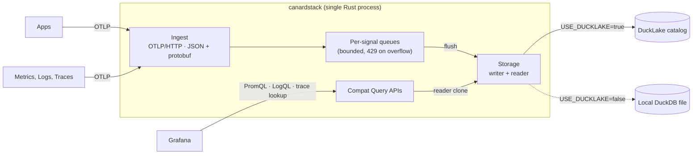

<h1>
  
  canardstack
</h1>


[](https://github.com/smithclay/canardstack/actions/workflows/ci.yml)
[](LICENSE)
[](https://ducklake.select/)
[](https://opentelemetry.io/)

> OpenTelemetry metrics, logs and traces stored in a ducklake. Query and visualize using Grafana.

canardstack is an experimental single-tenant observability backend powered by [DuckLake](https://ducklake.select/), an open Lakehouse format built on top of duckdb, parquet and object storage.

It accepts OpenTelemetry logs, traces, gauge metrics, and sum metrics over OTLP/HTTP, stores normalized tables in DuckLake, and exposes small compatibility-oriented HTTP query surfaces for local investigation and existing tools such as Grafana.

Builds on prior work from [otlp2parquet](https://github.com/smithclay/otlp2parquet), [otlp2pipeline](https://github.com/smithclay/otlp2pipeline), and [duckdb-otlp](https://github.com/smithclay/duckdb-otlp).

## Contents

- [Quickstart: MotherDuck-hosted DuckLake](#quickstart-motherduck-hosted-ducklake)
- [Quickstart: Local DuckLake](#quickstart-local-ducklake)
- [Architecture](#architecture)
- [Send Telemetry](#send-telemetry)
- [Query Data](#query-data)
- [Caveats](#caveats)
- [Documentation](#documentation)

## Quickstart: MotherDuck-hosted DuckLake

[MotherDuck](https://motherduck.com) has a free-tier hosted DuckLake that's useful for fast experiments and you can get it setup in under 5 minutes. You can also host your own DuckLake on any major cloud platform like [AWS](https://github.com/danielbeach/DuckLakeonS3andPostgres) or [Cloudflare](https://github.com/tobilg/cloudflare-ducklake).

After signing up for MotherDuck:

- Log in to https://app.motherduck.com/, create a new database and under "Advanced" choose "DuckLake"
- Copy the connection string for your DuckLake database, usually `md:your-database-name`
- Under Motherduck Account Settings > Access Tokens, create a new Read/Write token

Set your MotherDuck token and the remote DuckLake connection string:

```bash
export MOTHERDUCK_TOKEN='<your-motherduck-token>'
export CANARDSTACK_DUCKLAKE_ATTACH_URI='md:test-ducklake'
```

Start local canardstack and Grafana against the MotherDuck-hosted DuckLake:

```bash
docker compose up --build
```

Docker Compose runs canardstack on `http://localhost:4318` and Grafana on
`http://localhost:3000`. The canardstack container uses your
`CANARDSTACK_DUCKLAKE_ATTACH_URI` and `MOTHERDUCK_TOKEN` for storage, while the
Grafana container stays local and queries canardstack through the provisioned
Prometheus, Loki, and Tempo-compatible datasources.

Open the local investigation UI:

```text
http://localhost:4318/
```

In another terminal, seed representative telemetry through the local
canardstack service:

```bash
docker compose run --rm smoke
```

Then open the local Grafana overview dashboard:

```text
http://localhost:3000/d/canardstack-overview/canardstack-overview
```

Grafana is provisioned with canardstack datasources based on Prometheus, Loki, and Tempo APIs. Use `admin/admin` for logging on.

## Quickstart: Local DuckLake

Start canardstack with Docker Compose:

```bash
docker compose up --build
```

Open the local UI:

```text
http://localhost:4318/
```

Seed representative telemetry through the local canardstack service:

```bash
docker compose run --rm smoke
```

Open Grafana after running the smoke check:

```text
http://localhost:3000/d/canardstack-overview/canardstack-overview
```

## Architecture

A single Rust process accepts OTLP over HTTP and normalizes the records into per-signal tables in a DuckLake. Seperately, Prometheus / Loki / Tempo–shaped APIs are available over the same store so Grafana can visualize the data without a custom plugin.



## Send Telemetry

Configure an OTLP/HTTP exporter to forward data to the canardstack endpoint.
For example, an OpenTelemetry Collector exporter can point at the same port:

```yaml
exporters:
  otlphttp/canardstack:
    endpoint: http://localhost:4318
    headers:
      Authorization: Bearer dev-canardstack-key
```

Alternately, with Docker Compose send a sample metric, log, and trace"

```bash
docker compose run --rm smoke
```

## Query Data

The v0 query API is a set of compatibility adapters over the internal query engine based on Prometheus, Loki, and Tempo APIs. 

This makes it possible to use Grafana without custom plugins to visualize and query your metrics, logs and traces stored in duckdb.

Power users can query the same DuckLake/DuckDB data directly through DuckDB CLI, MotherDuck, or SQL clients.

## Caveats

canardstack is experimental and not production-ready. Use with caution, data loss may ocurr.

## Documentation

- [Developer guide](docs/developer.md)
- [V0 architecture](docs/architecture/v0-architecture.md)
- [Storage schema](docs/architecture/storage-schema.md)
- [Query API](docs/architecture/query-api.md)
- [UI workflows](docs/architecture/ui-workflows.md)
- [Operator metrics](docs/architecture/operator-metrics.md)
- [Benchmark plan](docs/planning/benchmark-plan.md)
- [Proof gates](docs/planning/proof-gates.md)
- [Failure runbooks](docs/runbooks/failure-runbooks.md)
