# Deployment Examples

This directory contains push-button examples for running canardstack from public
GitHub Container Registry images.

Set the image to a release tag:

```bash
export CANARDSTACK_IMAGE=ghcr.io/smithclay/canardstack:latest
```

The examples run the **same canardstack image** in two roles: one container
serves the ingest and query APIs (`canardstack serve`), while a second container
serves the DuckLake metadata catalog over the Quack protocol
(`canardstack serve-catalog`). The app attaches to that catalog over Quack and
writes DuckLake data files to object storage.

- `CANARDSTACK_DUCKLAKE_ATTACH_URI` points at the private Quack endpoint, for
  example `ducklake:quack:catalog.internal:443`.
- `CANARDSTACK_DUCKLAKE_QUACK_TOKEN` is the token canardstack uses with Quack.
- `CANARDSTACK_DUCKLAKE_DATA_PATH` points at object storage, such as
  `gcs://bucket/prefix/` or `s3://bucket/prefix/`.
- `CANARDSTACK_DUCKLAKE_CATALOG_PATH` is not set on the app in these examples;
  it is set on the `serve-catalog` container, which owns the catalog file.
- `CANARDSTACK_DUCKLAKE_QUACK_DISABLE_SSL` is set on the app only where the Quack
  link is plaintext (AWS intra-VPC). On Cloud Run the catalog is fronted by
  managed TLS, so it stays unset.
- `CANARDSTACK_POSTGRES_DSN` stays unset.

## Service Topology

```mermaid
flowchart TB
  subgraph GCP["GCP Cloud Run"]
    ClientG["OTel producers / Grafana clients"]
    AppG["Cloud Run service: canardstack\ncontainer: canardstack\nserve\nmin=1 max=1"]
    CatalogG["Cloud Run service: catalog\ncontainer: canardstack\nserve-catalog\ninternal ingress\nmin=1 max=1"]
    AppDataG["GCS-mounted app data volume\nCANARDSTACK_DATA_DIR\nraw spool + local DuckDB state"]
    CatalogFileG["GCS-mounted catalog volume\ncanardstack.ducklake metadata file"]
    DataG["GCS prefix\nDuckLake Parquet data files"]
    SecretsG["Secret Manager\nAPI keys + Quack token"]

    ClientG -->|"OTLP, Prometheus, Loki, Tempo HTTP"| AppG
    AppG -->|"fsync raw spool"| AppDataG
    AppG -->|"DuckLake catalog over Quack"| CatalogG
    CatalogG -->|"DuckDB opens metadata file"| CatalogFileG
    AppG -->|"DuckLake DATA_PATH"| DataG
    AppG -.-> SecretsG
    CatalogG -.-> SecretsG
  end

  subgraph AWS["AWS ECS/Fargate"]
    ClientA["OTel producers / Grafana clients"]
    Alb["Application Load Balancer\nHTTP :80"]
    AppA["ECS service: canardstack\ncontainer: canardstack\nserve\ndesired=1"]
    CatalogA["ECS service: catalog\ncontainer: canardstack\nserve-catalog\nprivate Cloud Map name\ndesired=1"]
    AppDataA["service-managed EBS volume\nCANARDSTACK_DATA_DIR\nraw spool + local DuckDB state"]
    CatalogFileA["service-managed EBS volume\ncanardstack.ducklake metadata file"]
    DataA["S3 prefix\nDuckLake Parquet data files"]
    SecretsA["Secrets Manager\nAPI keys + Quack token"]

    ClientA --> Alb
    Alb -->|"target :4318"| AppA
    AppA -->|"fsync raw spool"| AppDataA
    AppA -->|"DuckLake catalog over Quack"| CatalogA
    CatalogA -->|"DuckDB opens metadata file"| CatalogFileA
    AppA -->|"DuckLake DATA_PATH"| DataA
    AppA -.-> SecretsA
    CatalogA -.-> SecretsA
  end
```



Available examples:

- `gcp/cloud-run/` - Terraform for Google Cloud Infrastructure Manager, Cloud
  Run, a generated GCS bucket for deployment state and DuckLake data files, and
  an internal Cloud Run Quack catalog service.
- `aws/ecs-express/` - CloudFormation for ECS/Fargate, S3 DuckLake data files,
  generated VPC/subnets/security groups, Cloud Map service discovery, and an
  internal Quack catalog service with EBS.
