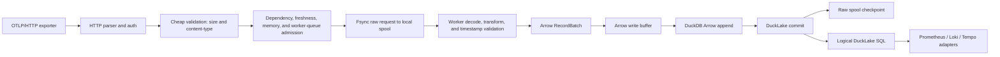

# Canardstack V0 Architecture

Canardstack is a single-binary OTLP/HTTP observability backend. It accepts
OpenTelemetry logs, traces, gauge metrics, and sum metrics; normalizes them with
`otlp2records`; appends Arrow `RecordBatch`es through DuckDB into DuckLake
tables; and serves bounded Prometheus, Loki, and Tempo compatibility APIs.

## Boundaries

Canardstack keeps these constraints:

- One Rust binary named `canardstack`.
- One synchronous standard-library HTTP server.
- One DuckDB process with DuckLake attached.
- One binary can be launched as `serve --role all`, `serve --role ingest`, or
  `serve --role query`; this is route partitioning, not a second service.
- OTLP/HTTP JSON and protobuf ingest only.
- No async runtime, OTLP/gRPC, Kafka, separate hot store, bundled Collector,
  DataFusion, Vortex, arbitrary SQL HTTP API, or second long-running service.

DuckLake/DuckDB is the source of truth for telemetry rows, snapshots, and query
execution. Compatibility APIs must not plan or read physical files directly, and
canardstack must not maintain a custom manifest duplicating DuckLake membership.

Metrics are supported for ingest and bounded compatibility behavior, but the
current sustained MVP performance envelope is only claimed for logs and traces.

## Data Flow

```text
OTLP/HTTP (JSON or protobuf, optional gzip)
  -> cheap request validation (auth, compressed size, content-type)
  -> dependency, freshness, runtime-memory, and worker-queue admission
  -> fsynced local raw spool write
  -> ingest worker decode, otlp2records transform, timestamp-skew validation
  -> Arrow RecordBatch
  -> Arrow write buffer
  -> DuckDB Arrow appender into DuckLake tables
  -> DuckLake commit
  -> raw spool checkpoint
  -> logical DuckLake SQL compatibility queries
```



Admission is freshness-first: before the durable raw-spool append, the request
projects seal visibility through the admission controller and is shed with `429`
when projected visibility exceeds the freshness budget. A cheap per-storage-signal
in-flight ceiling (`signal_inflight_full`) keeps one storage signal's burst from
monopolizing the accepted-but-not-yet-buffered window. There is no separate
in-memory queue and no separate storage-sink worker: ingest workers insert
directly into the Arrow write buffer, and a single scheduler-driven seal driver
is the only path that flushes that buffer to DuckLake and checkpoints the raw
spool.

## Ingest Semantics

A successful ingest response is `202`.

`202` means:

- The API key, content type, compressed body size, dependency health,
  freshness, and runtime-memory admission checks passed.
- The compressed raw request was written and fsynced to the local raw spool.
- The request was handed to an ingest worker, or — when every worker buffer is
  full — processed inline on the request thread, so accepted work always reaches
  the Arrow write buffer without waiting for restart replay.

`202` does not mean:

- The OTLP payload has already been decompressed, transformed, or
  timestamp-skew validated.
- The rows are DuckLake-committed.
- The rows are query-visible.
- Exactly-once delivery is guaranteed.

Crash behavior:

- A process crash, OS crash, VM crash, or power loss after `202` should replay
  fsynced raw-spool records that were not checkpointed.
- If an append fsync fails before `202`, canardstack rejects that request with
  `503 raw_spool_unavailable` and marks the raw spool unhealthy.

At-least-once duplicate window:

- If the process crashes after DuckLake storage commit but before raw-spool
  checkpoint, restart replay can duplicate that raw request.
- Exactly-once or request-id dedupe is post-MVP.

Retryable failure behavior:

- `429 raw_spool_full` when the raw-spool byte budget is exhausted.
- `429 raw_spool_queue_full` when the raw-spool writer queue is saturated.
- `429` for freshness-budget, process-memory, or runtime-memory pressure. (Worker
  buffer saturation does not reject: the request thread processes the spooled work
  inline, which raises latency as natural backpressure.)
- `503 raw_spool_unavailable` when the local spool cannot be opened, written,
  or append-synced.
- `503 dependency_unhealthy` when storage is unavailable.

## Raw Spool

The raw spool sits after cheap request validation and before decompression or
transform. It stores exactly the accepted request unit needed for replay:

- OTLP request kind
- content type
- optional content encoding
- accepted timestamp
- compressed body bytes
- sequence id and checksum

Recovery sequence:

```text
open segment -> append record on raw-spool writer
  -> write append batch -> force append fsync -> return 202
  -> worker decode/transform/timestamp check -> Arrow write buffer insert
  -> DuckLake storage commit
  -> checkpoint raw-spool record -> delayed checkpoint fsync -> segment reclaimable
```

Startup replays uncheckpointed records found by checksummed segment scanning
before scheduler work starts.
Replay enters the same decode, transform, buffer, flush, and DuckLake commit path
as normal ingest.

The raw-spool writer is on the ingest acknowledgement path through local file
writes and forced append fsync. It uses a bounded command queue; a saturated
append queue returns `429 raw_spool_queue_full` instead of parking request
threads. It batches channel receives and writes internally up to 64 records, or
until `CANARDSTACK_RAW_SPOOL_GROUP_COMMIT_MS` elapses from the first record in
the group. Append sync is forced before each `202`; the interval and byte knobs
still bound dirty data for internal writer cycles and shutdown. Append sync
knobs reject zero values at startup.

Checkpoint durability remains weaker than append sync. A lost checkpoint only
causes duplicate replay of data already accepted into storage. Checkpoint log
writes therefore acknowledge after the local write and fsync on looser internal
thresholds, plus writer shutdown.

Main knobs:

- `CANARDSTACK_RAW_SPOOL_CAPACITY_BYTES`
- `CANARDSTACK_RAW_SPOOL_GROUP_COMMIT_MS`
- `CANARDSTACK_RAW_SPOOL_APPEND_SYNC_MS`
- `CANARDSTACK_RAW_SPOOL_APPEND_SYNC_BYTES`

`CANARDSTACK_RAW_SPOOL_CAPACITY_BYTES` applies to each raw-spool lane. The
current lanes are logs, traces, and metrics, so worst-case aggregate raw-spool
disk use can reach roughly three times the configured value.
Size the local data directory for the aggregate budget, not just one lane.

## Worker Buffers And Seal

HTTP request threads run only cheap validation and rejectable admission gates,
then hand durably-spooled work to a fixed pool of ingest workers over bounded
worker buffers. Workers perform decompression, `otlp2records` transform,
timestamp-skew validation, and Arrow write-buffer insertion. When every worker
buffer is full the request thread processes that spooled work inline rather than
deferring it, so accepted data is never stranded until a restart. Malformed or
skew-rejected accepted payloads are durably terminal-checkpointed so they do
not replay forever. The ingest worker pool is the single "parallel ingest
across OS threads" concept; there is no separate dataflow topology or
storage-sink stage. Worker-buffer ownership is intentionally low-cardinality:
storage signal plus source encoding.

Memory and worker-buffer guardrails:

- `CANARDSTACK_MAX_BODY_BYTES`, default 8 MiB.
- `CANARDSTACK_INGEST_MEMORY_BYTES`, default 2 GiB. The per-signal in-flight
  ceiling derives from this total budget.
- `CANARDSTACK_INGEST_WORKERS`, default 4 ingest workers.
- `CANARDSTACK_INGEST_WORKER_CHANNEL_CAPACITY`, default 1024 in-flight handoffs,
  split across workers.
- Optional `CANARDSTACK_PROCESS_MEMORY_LIMIT_BYTES`.

Seal triggers:

- `CANARDSTACK_SEAL_RATE_SEED_BYTES`, default 4 MiB.
- `CANARDSTACK_SEAL_RATE_SEED_WINDOW_SECS` or `_MS`, default 10 seconds.

A single scheduler-driven seal driver is the only seal path. It flushes on a
frequent cadence (`CANARDSTACK_SEAL_INTERVAL_MS`, default 1s) or earlier when a
buffered signal reaches its size
(`CANARDSTACK_ARROW_WRITE_BUFFER_TARGET_BYTES`) or age
(`CANARDSTACK_ARROW_WRITE_BUFFER_MAX_AGE_*`) threshold. The cadence must stay
well under the freshness-budget SLA so Arrow write-buffer age never approaches
the admission reject threshold; it is deliberately decoupled from the coarse
maintenance interval. Each seal captures the set of pending raw-spool records,
force-flushes the Arrow write buffer under seal admission, appends rows through
DuckDB's Arrow appender, commits DuckLake, and then checkpoints exactly the
captured records. Capturing before flushing is load-bearing for at-least-once: a
record appended after the capture is checkpointed on a later seal, never before
its rows are durable. Admin seal uses the same path on demand.

Freshness-budget admission happens before raw-spool append. The request path
uses two local debt signals:

- in-flight debt: accepted-but-not-yet-buffered (in-flight) bytes and oldest
  age before ingest workers move batches into storage buffers.
- visibility-buffer debt: Arrow write-buffer bytes and age beyond the
  configured buffer target and max age, before rows are DuckLake-committed.

The admission controller estimates freshness budget:

```text
projected_seal_seconds = inflight_bytes / ewma_seal_bytes_per_sec
projected_buffer_seconds =
  excess_buffer_bytes / arrow_write_buffer_bytes_per_sec
  + max(0, oldest_buffer_age_seconds - arrow_write_buffer_max_age_seconds)
projected_visibility_seconds =
  max(oldest_queue_age_seconds + projected_seal_seconds,
      projected_buffer_seconds)
```

If projected visibility exceeds `CANARDSTACK_FRESHNESS_BUDGET_SLA_SECS` or
`_MS`, the request returns retryable `429 freshness_budget_exceeded` and does
not write the raw spool. Queue, process-memory, and runtime-memory pressure
remain bounded and retryable.

## Admission Primitives

The process has one small admission controller with three distinct primitives:

- freshness budget: checks projected visibility plus a per-storage-signal
  in-flight ceiling before durable raw-spool append.
- seal admission: reserves capacity for the scheduled seal driver and manual
  seal before query capacity is considered.
- query admission: splits compatibility routes into cheap and heavy classes.

Operator/control routes keep health, metrics, and admin health available in
every serve role without using query admission.

Heavy range/search/trace queries consume only the remaining query capacity after
the seal and cheap-query reservations. When projected visibility debt reaches
the freshness-budget SLA, heavy query capacity degrades to
`CANARDSTACK_HEAVY_QUERY_DEGRADED_CAPACITY`. If debt keeps rising, heavy queries
return a protocol-compatible `429 freshness_debt` envelope. Cheap metadata,
label, probe, and instant-ish routes retain
`CANARDSTACK_CHEAP_QUERY_ADMISSION_CAPACITY`.

Admission knobs:

- `CANARDSTACK_SEAL_ADMISSION_CAPACITY`, default `1`.
- `CANARDSTACK_CHEAP_QUERY_ADMISSION_CAPACITY`, default `1`.
- `CANARDSTACK_HEAVY_QUERY_DEGRADED_CAPACITY`, default `1`.
- `CANARDSTACK_FRESHNESS_BUDGET_SLA_SECS` or `_MS`, default `15s`.

## Storage

DuckLake is the storage coordinator. It owns snapshots, registered data-file
membership, partition metadata, and table visibility. Canardstack writes
prepared Arrow `RecordBatch`es to DuckLake tables through DuckDB's Arrow
appender inside an explicit DuckDB transaction per flush batch. The appender is
the only supported ingest write path; appender or commit failure restores the
Arrow write buffer and leaves raw-spool records uncheckpointed for retry.

Tables:

- `logs`
- `spans`
- `metric_gauge`
- `metric_sum`
- `metadata_summary`

Arrow write-buffer flushing is controlled by:

- `CANARDSTACK_ARROW_WRITE_BUFFER_TARGET_BYTES`
- `CANARDSTACK_ARROW_WRITE_BUFFER_MAX_AGE_SECS` or `_MS`

Local DuckLake is the default. Remote DuckLake attach URIs are supported, but
the core architecture remains the same.

## Query Path

All HTTP compatibility queries go through `QueryEngine`, which applies:

- time-range bounds
- row/result limits
- server-owned timeout
- DuckDB memory limit
- query concurrency limits

Prometheus, Loki, and Tempo adapters execute bounded logical SQL against
DuckLake tables. DuckDB/DuckLake owns physical file planning and reads.
Route-level query admission runs before `QueryEngine`: cheap discovery and
instant-ish routes reserve protected cheap-query admission, while
range/search/trace routes reserve heavy-query admission.

Direct SQL is intentionally outside the normal HTTP API. Operators or users who
need SQL should use DuckDB CLI, MotherDuck, or another SQL client against the
same DuckLake catalog.

## Operator Surface

Public health:

- `GET /healthz`

Admin health:

- `GET /api/admin/health/storage`
- `GET /api/admin/health/ingest`
- `GET /api/admin/health/maintenance`
- `GET /api/admin/health/queries`

Metrics:

- `GET /metrics`

The operator surface distinguishes:

- accepted requests
- raw-spooled records and bytes
- pending replay records and bytes
- queued rows and bytes
- Arrow-appended and DuckLake-flushed rows
- DuckLake-visible rows and active data files
- checkpointed raw-spool records
- raw-spool full
- raw-spool unavailable
- storage unavailable

See [operator metrics](operator-metrics.md) and
[failure runbooks](../runbooks/failure-runbooks.md) for the concrete metric and
endpoint names.

## Maintenance

The API binary starts one in-process scheduler unless
`CANARDSTACK_SCHEDULER_ENABLED=false`. `CANARDSTACK_MAINTENANCE_INTERVAL_SECS`
sets the base cadence; individual job cadences are derived from it.

Scheduler jobs:

- single seal driver (flushes the Arrow write buffer on size/age threshold or
  the freshness cadence, then checkpoints the raw spool after DuckLake commit)
- metadata refresh
- operator metric snapshot
- retention
- snapshot expiration and cleanup when supported by DuckLake

Maintenance can be paused and resumed through admin endpoints. There is no
Postgres-backed maintenance lease yet, so assume one in-process scheduler and
one writer. Pause applies to scheduled jobs only; manual repair endpoints such
as seal and retention remain available.

In `serve --role query`, ingest routes and maintenance mutation routes are not
served. Public health, `/metrics`, and admin health endpoints stay available.
In `serve --role ingest`, ingest and maintenance mutation routes are served,
but compatibility query routes are not. The default `serve --role all` preserves
the previous all-in-one behavior.

## Retention

Retention is whole-day oriented and bounded by `CANARDSTACK_RETENTION_DAYS`,
default 14.

The current implementation uses bounded table deletes plus DuckLake snapshot
expiration/cleanup hooks where available. Physical file compaction is not
enabled until DuckLake `ducklake_merge_adjacent_files` is proven stable for this
write pattern. Physical day-table layouts are not part of the current MVP.

## Compatibility Surface

Prometheus:

- `GET/POST /api/v1/query`
- `GET/POST /api/v1/query_range`
- `GET /api/v1/labels`
- `GET /api/v1/label/{name}/values`
- `GET /api/v1/series`
- `GET /api/v1/metadata`

Loki:

- `GET /loki/api/v1/query_range`
- `GET /loki/api/v1/query`
- `GET /loki/api/v1/labels`
- `GET /loki/api/v1/label/{name}/values`
- `GET /loki/api/v1/series`

Tempo:

- `GET /api/v2/traces/{traceID}`
- `GET /api/traces/{traceID}`
- `GET /api/search`
- `GET /api/search/tags`
- `GET /api/search/tag/{tag}/values`
- `GET /api/v2/search/tags`
- `GET /api/v2/search/tag/{tag}/values`

Grafana probe shim:

- `GET /api/status/buildinfo`

These are compatibility subsets, not complete protocol implementations.
Unsupported query forms return protocol-shaped error envelopes.
