# Canardstack V0 Architecture

Canardstack is a single-binary OTLP/HTTP observability backend. It accepts
OpenTelemetry logs, traces, gauge metrics, and sum metrics; normalizes them with
`otlp2records`; appends Arrow `RecordBatch`es through DuckDB into DuckLake
tables; and serves bounded Prometheus, Loki, and Tempo compatibility APIs.

## Boundaries

Canardstack keeps these constraints:

- One Rust binary named `canardstack`.
- One synchronous standard-library HTTP server.
- One DuckDB process with DuckLake attached.
- One binary can be launched as `serve --role all`, `serve --role ingest`, or
  `serve --role query`; this is route partitioning, not a second service.
- OTLP/HTTP JSON and protobuf ingest only.
- No async runtime, OTLP/gRPC, Kafka, separate hot store, bundled Collector,
  DataFusion, Vortex, arbitrary SQL HTTP API, or second long-running service.

DuckLake/DuckDB is the source of truth for telemetry rows, snapshots, and query
execution. Compatibility APIs must not plan or read physical files directly, and
canardstack must not maintain a custom manifest duplicating DuckLake membership.

Metrics are supported for ingest and bounded compatibility behavior, but the
current sustained MVP performance envelope is only claimed for logs and traces.

## Punts / Non-Goals (v0)

These are deliberate v0 non-goals, called out so they are not mistaken for
oversights. Each is documented in full in its own section below.

- Physical file maintenance planner — canardstack does not maintain physical
  file membership, manifests, or a custom compactor. DuckDB/DuckLake owns
  inlining flush, small-file merge, rewrite, snapshot expiration, cleanup, and
  orphan deletion through configured DuckLake options plus `CHECKPOINT`.
- Online schema evolution — the storage schema is static. Columns are fixed
  const lists created with `CREATE TABLE IF NOT EXISTS`; there is no migration
  tool or `ALTER ... ADD COLUMN` path. Changing columns requires a coordinated
  manual migration (or a fresh catalog). OTLP fields without a typed column are
  carried as JSON in the `*_attributes` columns, not promoted to new columns.
  A `schema_version` in a `canardstack_meta` catalog table fences this: boot
  fails closed when the catalog is outside the binary's supported version window.
  See [Storage](#storage) and [Schema Versioning and
  Compatibility](storage-schema.md#schema-versioning-and-compatibility).
- Row-level dedup — ingest is at-least-once, so crash-replay can produce
  duplicate rows and v0 surfaces them verbatim. See the delivery-semantics note
  under [Ingest Semantics](#ingest-semantics); not duplicated here.
- Single in-process scheduler / single writer — there is no Postgres-backed
  maintenance lease yet, so assume exactly one scheduler thread and one DuckDB
  writer. See [Maintenance](#maintenance).

NOT a punt: metadata refresh is a first-class derived pipeline stage, not a
deferred feature. It runs off the ingest commit path — dirty signal/date buckets
recorded at seal commit are re-aggregated into `metadata_summary` by the bounded
`metadata_refresh` scheduler job, which bumps the storage `metadata_generation`
to invalidate the generation-keyed discovery cache. See
[Maintenance](#maintenance) and [Operator Surface](#operator-surface).

## Data Flow

```text
OTLP/HTTP (JSON or protobuf, optional gzip)
  -> cheap request validation (auth, compressed size, content-type)
  -> dependency, freshness, runtime-memory, and worker-queue admission
  -> fsynced local raw spool write
  -> ingest worker decode, otlp2records transform, timestamp-skew validation
  -> Arrow RecordBatch
  -> Arrow write buffer (rows plus durability disposition)
  -> DuckDB Arrow appender into DuckLake tables
  -> DuckLake commit
  -> raw spool checkpoint
  -> logical DuckLake SQL compatibility queries
```



```mermaid
flowchart LR
  A["OTLP/HTTP exporter"] --> B["HTTP parser and auth"]
  B --> C["Cheap validation: size and content-type"]
  C --> D["Dependency, freshness, memory, and worker-queue admission"]
  D --> E["Fsync raw request to local spool"]
  E --> F["Worker decode, transform, and timestamp validation"]
  F --> G["Arrow RecordBatch"]
  G --> H["Arrow write buffer: rows + durability"]
  H --> I["DuckDB Arrow append"]
  I --> J["DuckLake commit"]
  J --> K["Raw spool checkpoint"]
  J --> L["Logical DuckLake SQL"]
  L --> M["Prometheus / Loki / Tempo adapters"]
```

Admission is freshness-first: before the durable raw-spool append, the request
projects seal visibility through the admission controller and is shed with `429`
when projected visibility exceeds the freshness budget. That freshness
projection is the sole soft shed; the optional process RSS limit
(`runtime_memory_full`) is the sole hard cap. The per-storage-signal in-flight
bytes are pure accounting: the freshness projection consumes their total, and
the `canardstack_ingest_inflight_bytes` gauge exposes per-signal occupancy.
They do not gate admission. There is no separate in-memory queue and no separate storage-sink
worker: ingest workers insert directly into the Arrow write buffer, and a single
scheduler-driven seal driver is the only path that flushes that buffer to
DuckLake and checkpoints the raw spool.

## Ingest Semantics

A successful ingest response is `202`.

`202` means:

- The API key, content type, compressed body size, dependency health,
  freshness, and runtime-memory admission checks passed.
- The compressed raw request was written and fsynced to the local raw spool.
- The request was handed to an ingest worker, or — when every worker buffer is
  full — processed inline on the request thread, so accepted work always reaches
  the Arrow write buffer without waiting for restart replay.

`202` does not mean:

- The OTLP payload has already been decompressed, transformed, or
  timestamp-skew validated.
- The rows are DuckLake-committed.
- The rows are query-visible.
- Exactly-once delivery is guaranteed.

Crash behavior:

- A process crash, OS crash, VM crash, or power loss after `202` should replay
  fsynced raw-spool records that were not checkpointed.
- If an append fsync fails before `202`, canardstack rejects that request with
  `503 raw_spool_unavailable` and marks the raw spool unhealthy.

Delivery semantics (at-least-once, duplicate rows possible):

- A `202` means the raw request was durably spooled (written and fsynced), and
  the system is at-least-once from that point on.
- The raw-spool checkpoint deliberately follows the DuckLake commit
  (capture-before-flush, checkpoint-after-commit) so that only storage-committed
  records are ever checkpointed.
- The consequence: if the process crashes after DuckLake storage commit but
  before raw-spool checkpoint, restart replay re-ingests that raw request,
  producing duplicate ROWS in storage.
- v0 does NOT dedup. Those duplicate rows are surfaced verbatim, so query results
  can contain duplicates after a crash-recovery. Exactly-once or request-id
  dedupe is post-MVP.

Retryable failure behavior:

- `429 raw_spool_full` when the raw-spool byte budget is exhausted.
- `429 raw_spool_queue_full` when the raw-spool writer queue is saturated.
- `429` for freshness-budget, process-memory, or runtime-memory pressure. (Worker
  buffer saturation does not reject: the request thread processes the spooled work
  inline, which raises latency as natural backpressure.)
- `503 raw_spool_unavailable` when the local spool cannot be opened, written,
  or append-synced.
- `503 dependency_unhealthy` when storage is unavailable.

## Raw Spool

The raw spool sits after cheap request validation and before decompression or
transform. It stores exactly the accepted request unit needed for replay:

- OTLP request kind
- content type
- optional content encoding
- accepted timestamp
- compressed body bytes
- sequence id and checksum

Recovery sequence:

```text
open segment -> append record on raw-spool writer
  -> write append batch -> force append fsync -> return 202
  -> worker decode/transform/timestamp check -> Arrow write buffer insert
  -> DuckLake storage commit
  -> checkpoint raw-spool record -> delayed checkpoint fsync -> segment reclaimable
```

Startup replays uncheckpointed records found by checksummed segment scanning
before scheduler work starts.
Replay enters the same decode, transform, buffer, flush, and DuckLake commit path
as normal ingest.

The raw-spool writer is on the ingest acknowledgement path through local file
writes and forced append fsync. It uses a bounded command queue; a saturated
append queue returns `429 raw_spool_queue_full` instead of parking request
threads. It batches channel receives and writes internally up to 64 records, or
until `CANARDSTACK_RAW_SPOOL_GROUP_COMMIT_MS` elapses from the first record in
the group. Append fsync is forced before each append acknowledgement, so there
are no delayed append-sync interval or byte knobs.

Checkpoint durability remains weaker than append fsync. A lost checkpoint only
causes duplicate replay of data already accepted into storage. Checkpoint log
writes therefore acknowledge after the local write and fsync on looser internal
thresholds, plus writer shutdown.

Main knobs:

- `CANARDSTACK_RAW_SPOOL_CAPACITY_BYTES`
- `CANARDSTACK_RAW_SPOOL_GROUP_COMMIT_MS`

`CANARDSTACK_RAW_SPOOL_CAPACITY_BYTES` applies to each per-request-kind raw
spool. The current request kinds are logs, traces, and metrics, so worst-case
aggregate raw-spool disk use can reach roughly three times the configured value.
Size the local data directory for the aggregate budget, not just one request
kind.

## Worker Buffers And Seal

HTTP request threads run only cheap validation and rejectable admission gates,
then hand durably-spooled work to a fixed pool of ingest workers over bounded
worker buffers. Workers perform decompression, `otlp2records` transform,
timestamp-skew validation, and Arrow write-buffer insertion. When every worker
buffer is full the request thread processes that spooled work inline rather than
deferring it, so accepted data is never stranded until a restart. Malformed or
skew-rejected accepted payloads are durably terminal-checkpointed so they do
not replay forever. The ingest worker pool is the single "parallel ingest
across OS threads" concept; there is no separate dataflow topology or
storage-sink stage. Worker-buffer ownership is intentionally low-cardinality:
storage signal plus source encoding.

The Arrow write buffer is replay-backed only: every buffered row carries the
raw-spool record ref that must be checkpointed only after the rows commit to
DuckLake. The opt-in operator-metrics snapshot is internal self-telemetry and
commits through a separate direct path, so it cannot become a non-replay-backed
producer inside the external ingest buffer.

Memory and worker-buffer guardrails:

- `CANARDSTACK_MAX_BODY_BYTES`, default 8 MiB.
- There is no per-signal ingest memory budget knob; the freshness projection
  (and the optional process RSS limit) are the only memory backstops.
- `CANARDSTACK_INGEST_WORKERS`, default 4 ingest workers.
- The worker-handoff channel capacity is a fixed internal mechanic (1024
  in-flight handoffs, split across workers), not a config knob.
- Optional `CANARDSTACK_PROCESS_MEMORY_LIMIT_BYTES`.

Seal triggers:

- The seal-rate EWMA seed (4 MiB over 10 seconds) is a fixed internal warm-up
  mechanic, not a config knob; the estimator converges to measured throughput.

A single scheduler-driven seal owner (`seal::SealDriver` plus
`seal::commit_buffered_rows`) is the only seal path. It flushes on a frequent
cadence (`CANARDSTACK_SEAL_INTERVAL_MS`,
default 1s) or earlier when a buffered signal reaches its size
(`CANARDSTACK_ARROW_WRITE_BUFFER_TARGET_BYTES`) or age
(`CANARDSTACK_ARROW_WRITE_BUFFER_MAX_AGE_*`) threshold. The cadence must stay
well under the freshness-budget SLA so Arrow write-buffer age never approaches
the admission reject threshold; it is deliberately decoupled from the coarse
maintenance interval. Each seal snapshots typed buffered rows, force-flushes the
snapshot under seal admission, appends rows through DuckDB's Arrow appender,
commits DuckLake, and then checkpoints exactly the replay-backed raw-spool refs
from the committed snapshot. Commit failure restores the whole typed snapshot to
the write buffer. Commit success plus checkpoint failure leaves the raw-spool
records pending, so they replay as duplicate rows on a future restart. Admin
seal uses the same path on demand.

Freshness-budget admission happens before raw-spool append. The request path
uses two local debt signals:

- in-flight debt: accepted-but-not-yet-buffered (in-flight) bytes, plus the
  incoming request bytes, before ingest workers move batches into the Arrow
  write buffer.
- visibility-buffer debt: Arrow write-buffer bytes and age beyond the
  configured buffer target and max age, before rows are DuckLake-committed.

The admission controller estimates freshness budget:

```text
projected_seal_seconds   = (inflight_bytes + incoming_bytes) / ewma_seal_bytes_per_second
projected_buffer_seconds = buffer_size_debt + buffer_age_debt
    buffer_size_debt = max(0, buffered_bytes - arrow_write_buffer_target_bytes * buffered_active_count)
                       / ewma_seal_bytes_per_second
    buffer_age_debt  = max(0, oldest_buffer_age_seconds - arrow_write_buffer_max_age_seconds)
projected_visibility_seconds = max(projected_seal_seconds, projected_buffer_seconds)
```

The inputs are the `FreshnessBudgetInputs` fields (`inflight_bytes`,
`incoming_bytes`, `buffered_bytes`, `buffered_active_count`,
`oldest_buffer_age_seconds`). A single observed seal-rate EWMA
(`ewma_seal_bytes_per_second`) drains BOTH the seal debt and the buffer-size
debt, so the two share one drain estimate.

If projected visibility exceeds `CANARDSTACK_FRESHNESS_BUDGET_SLA_SECS` or
`_MS`, the request returns retryable `429 freshness_budget_exceeded` and does
not write the raw spool. Queue, process-memory, and runtime-memory pressure
remain bounded and retryable.

## Admission Primitives

The process has one small admission controller with three distinct primitives:

- freshness budget: checks projected visibility before durable raw-spool append
  and is the sole soft ingest shed. The per-storage-signal in-flight bytes are
  accounting plus a soft pressure reference that feeds that projection, not an
  admission ceiling.
- seal admission: reserves capacity for the scheduled seal driver and manual
  seal before query capacity is considered.
- query admission: splits compatibility routes into cheap and heavy classes.

Operator/control routes keep health, metrics, and admin health available in
every serve role without using query admission.

Default memory backstop: the freshness budget is the default ingest memory
backstop. The former per-signal in-flight ceiling was removed, and the process
RSS hard cap is opt-in and OFF by default. Because admit_ingest rejects when
projected seal visibility exceeds ~0.95x the SLA, it transitively bounds
in-flight bytes at roughly
`0.95 x freshness_budget_sla_seconds x ewma_seal_bytes_per_second`. During EWMA
warm-up that bound rides on the fixed internal seal-rate seed (4 MiB over 10
seconds), which is not configurable. Operators who want an explicit RSS hard cap
must set `CANARDSTACK_PROCESS_MEMORY_LIMIT_BYTES` / `runtime_memory_limit_bytes`.

Heavy range/search/trace queries consume only the remaining query capacity after
the seal and cheap-query reservations. When projected visibility debt reaches
the freshness-budget SLA, heavy query capacity degrades to
`CANARDSTACK_HEAVY_QUERY_DEGRADED_CAPACITY`. If debt keeps rising, heavy queries
return a protocol-compatible `429 freshness_debt` envelope. Cheap metadata,
label, probe, and instant-ish routes retain
`CANARDSTACK_CHEAP_QUERY_ADMISSION_CAPACITY`. Compatibility query routes wait
briefly for saturated query admission before returning `429`, so normal
dashboard fanout can drain through short-lived query slots.

Admission knobs:

- `CANARDSTACK_SEAL_ADMISSION_CAPACITY`, default `1`.
- `CANARDSTACK_CHEAP_QUERY_ADMISSION_CAPACITY`, default `1`.
- `CANARDSTACK_HEAVY_QUERY_DEGRADED_CAPACITY`, default `1`.
- `CANARDSTACK_QUERY_ADMISSION_WAIT_SECS` or `_MS`, default `1s`.
- `CANARDSTACK_FRESHNESS_BUDGET_SLA_SECS` or `_MS`, default `15s`.

## Storage

DuckLake is the storage coordinator. It owns snapshots, registered data-file
membership, partition metadata, and table visibility. Canardstack writes
prepared Arrow `RecordBatch`es to DuckLake tables through DuckDB's Arrow
appender inside an explicit DuckDB transaction per flush batch. The appender is
the only supported ingest write path; appender or commit failure restores the
Arrow write buffer and leaves raw-spool records uncheckpointed for retry.

Tables:

- `logs`
- `spans`
- `metric_gauge`
- `metric_sum`
- `metadata_summary`

Arrow write-buffer flushing is controlled by:

- `CANARDSTACK_ARROW_WRITE_BUFFER_TARGET_BYTES`
- `CANARDSTACK_ARROW_WRITE_BUFFER_MAX_AGE_SECS` or `_MS`

Local DuckLake is the default. Remote DuckLake attach URIs are supported, but
the core architecture remains the same.

## Query Path

All HTTP compatibility queries go through `QueryEngine`, which applies:

- time-range bounds
- row/result limits
- server-owned timeout
- DuckDB memory limit
- query concurrency limits

Prometheus, Loki, and Tempo adapters execute bounded logical SQL against
DuckLake tables. DuckDB/DuckLake owns physical file planning and reads.
Route-level query admission runs before `QueryEngine`: cheap discovery and
instant-ish routes reserve protected cheap-query admission, while
range/search/trace routes reserve heavy-query admission.

Direct SQL is intentionally outside the normal HTTP API. Operators or users who
need SQL should use DuckDB CLI, MotherDuck, or another SQL client against the
same DuckLake catalog.

## Operator Surface

Public health:

- `GET /healthz`

Admin health:

- `GET /api/admin/health/storage`
- `GET /api/admin/health/ingest`
- `GET /api/admin/health/maintenance`
- `GET /api/admin/health/queries`

Metrics:

- `GET /metrics`

The operator surface distinguishes:

- accepted requests
- raw-spooled records and bytes
- pending replay records and bytes
- buffered (Arrow write-buffer) rows and bytes
- Arrow-appended and DuckLake-flushed rows
- DuckLake-visible rows and active data files
- checkpointed raw-spool records
- raw-spool full
- raw-spool unavailable
- storage unavailable

See [operator metrics](operator-metrics.md) and
[failure runbooks](https://smithclay.github.io/canardstack/operations/failure-runbooks/) for the concrete metric and
endpoint names.

## Maintenance

The API binary starts one in-process scheduler unless
`CANARDSTACK_SCHEDULER_ENABLED=false`. `CANARDSTACK_MAINTENANCE_INTERVAL_SECS`
sets the base cadence; individual job cadences are derived from it.

Scheduler jobs:

- single seal driver (flushes the Arrow write buffer on size/age threshold or
  the freshness cadence, then checkpoints the raw spool after DuckLake commit)
- metadata refresh
- operator metric snapshot
- retention followed by DuckDB/DuckLake `CHECKPOINT` when
  `CANARDSTACK_DUCKLAKE_MAINTENANCE_ENABLED=true`

Maintenance can be paused and resumed through admin endpoints. There is no
Postgres-backed maintenance lease yet, so assume one in-process scheduler and
one writer. Pause applies to scheduled jobs only; manual repair endpoints such
as seal and retention remain available.

The single writer connection plus the single in-process scheduler is a
deliberate throughput ceiling for v0, not an accident: all writes (seal flush,
metadata refresh, retention) serialize on one DuckDB writer driven by one
scheduler thread. On that thread seal is prioritized over the non-seal jobs —
when the oldest Arrow write buffer approaches the freshness-budget SLA the
scheduler skips metadata refresh, the operator-metric snapshot, and retention for
that tick so a slow job cannot hold the thread and delay a due seal. The eventual
answer to scaling maintenance horizontally is the Postgres-backed maintenance
lease (not yet implemented), which would let more than one node coordinate writes
safely. Until then, watch the `writer_lock_wait` phase on
`canardstack_phase_duration_seconds` (emitted on both the seal flush and
metadata-refresh paths) as the signal that this ceiling is being hit.

In `serve --role query`, ingest routes and maintenance mutation routes are not
served. Public health, `/metrics`, and admin health endpoints stay available.
In `serve --role ingest`, ingest and maintenance mutation routes are served,
but compatibility query routes are not. The default `serve --role all` preserves
the previous all-in-one behavior.

## Retention

Retention is whole-day oriented and bounded by `CANARDSTACK_RETENTION_DAYS`,
default 14.

The current implementation uses bounded table deletes for canardstack-owned
telemetry timestamp retention, then lets DuckDB/DuckLake run the physical
maintenance sequence with `CHECKPOINT`: inlined-data flush, snapshot expiration,
adjacent-file merge, delete-file rewrite, cleanup, and orphan deletion. Operators
can also run `POST /api/admin/maintenance/checkpoint/run` to trigger this
physical maintenance path without applying logical telemetry retention deletes.
The configured DuckLake defaults are `data_inlining_row_limit = 10`,
`auto_compact = true`, `expire_older_than` aligned with telemetry retention, and
`delete_older_than = 1 day`. `rewrite_delete_threshold` and `target_file_size`
are left to DuckLake defaults unless benchmark evidence says canardstack needs a
different streaming-ingest policy.

Setting `CANARDSTACK_DUCKLAKE_MAINTENANCE_ENABLED=false` keeps row-level
telemetry retention but skips `CHECKPOINT` and sets DuckLake `auto_compact=false`
with data inlining off by default, approximating the old no-physical-maintenance
behavior. Manual dry-runs also skip `CHECKPOINT` because DuckLake `CHECKPOINT`
has no dry-run mode; the JSON response reports that explicitly.

Online schema evolution under continuous arrival is a separate but related v0
punt (the storage schema is static); a catalog `schema_version` guard
(`canardstack_meta`) keeps an incompatible binary/catalog pairing a loud boot
failure rather than a silent misread. See [Punts / Non-Goals
(v0)](#punts--non-goals-v0), [Storage](#storage), and [Schema Versioning and
Compatibility](storage-schema.md#schema-versioning-and-compatibility).

## Compatibility Surface

Prometheus:

- `GET/POST /api/v1/query`
- `GET/POST /api/v1/query_range`
- `GET /api/v1/labels`
- `GET /api/v1/label/{name}/values`
- `GET /api/v1/series`
- `GET /api/v1/metadata`

Loki:

- `GET /loki/api/v1/query_range`
- `GET /loki/api/v1/query`
- `GET /loki/api/v1/labels`
- `GET /loki/api/v1/label/{name}/values`
- `GET /loki/api/v1/series`

Tempo:

- `GET /api/v2/traces/{traceID}`
- `GET /api/traces/{traceID}`
- `GET /api/search`
- `GET /api/search/tags`
- `GET /api/search/tag/{tag}/values`
- `GET /api/v2/search/tags`
- `GET /api/v2/search/tag/{tag}/values`

Grafana probe shim:

- `GET /api/status/buildinfo`

These are compatibility subsets, not complete protocol implementations.
Unsupported query forms return protocol-shaped error envelopes.
