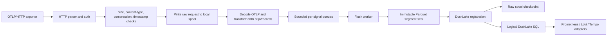

# Canardstack V0 Architecture

Canardstack is a single-binary OTLP/HTTP observability backend. It accepts
OpenTelemetry logs, traces, gauge metrics, and sum metrics; normalizes them with
`otlp2records`; stores immutable Parquet segments registered in DuckLake; and
serves bounded Prometheus, Loki, and Tempo compatibility APIs.

## Boundaries

Canardstack keeps these constraints:

- One Rust binary named `canardstack`.
- One synchronous standard-library HTTP server.
- One DuckDB process with DuckLake attached.
- One binary can be launched as `serve --role all`, `serve --role ingest`, or
  `serve --role query`; this is route partitioning, not a second service.
- OTLP/HTTP JSON and protobuf ingest only.
- No async runtime, OTLP/gRPC, Kafka, separate hot store, bundled Collector,
  DataFusion, Vortex, arbitrary SQL HTTP API, or second long-running service.

DuckLake/DuckDB is the source of truth for registered telemetry files and query
execution. Compatibility APIs must not plan or read raw Parquet files directly,
and canardstack must not maintain a custom manifest duplicating DuckLake file
membership.

Metrics are supported for ingest and bounded compatibility behavior, but the
current sustained MVP performance envelope is only claimed for logs and traces.

## Data Flow

```text
OTLP/HTTP (JSON or protobuf, optional gzip)
  -> request validation
  -> local raw spool write, pending periodic append sync
  -> inline decode and otlp2records transform
  -> bounded in-process queues
  -> immutable Parquet segment files
  -> ducklake_add_data_files registration
  -> logical DuckLake SQL compatibility queries
```



## Ingest Semantics

A successful ingest response is `202`.

`202` means:

- The API key, content type, body size, compression, and timestamp skew passed.
- The compressed raw request was accepted by the local raw-spool writer and
  written to the active spool file.
- The append may still be pending the next periodic or byte-threshold append
  sync.

`202` does not mean:

- The rows are DuckLake-committed.
- The rows are query-visible.
- The raw-spool append has been fsynced.
- Exactly-once delivery is guaranteed.

Crash behavior:

- A process crash should generally replay written raw-spool records if the OS
  page cache and file contents survive.
- An OS crash, VM crash, power loss, or disk/controller failure may lose records
  accepted since the most recent successful append sync.
- If a periodic append sync fails after records have received `202`,
  canardstack marks the raw spool unhealthy and rejects subsequent ingest with
  `503 raw_spool_unavailable`.

At-least-once duplicate window:

- If the process crashes after DuckLake storage commit but before raw-spool
  checkpoint, restart replay can duplicate that raw request.
- Exactly-once or request-id dedupe is post-MVP.

Retryable failure behavior:

- `429 raw_spool_full` when the raw-spool byte budget is exhausted.
- `429` for freshness-budget, queue, process-memory, or runtime-memory pressure.
- `503 raw_spool_unavailable` when the local spool cannot be opened, written,
  or append-synced.
- `503 dependency_unhealthy` when storage is unavailable.

## Raw Spool

The raw spool sits after cheap request validation and before decompression or
transform. It stores exactly the accepted request unit needed for replay:

- signal route
- content type
- optional content encoding
- accepted timestamp
- compressed body bytes
- sequence id and checksum

Recovery sequence:

```text
open segment -> append record on raw-spool writer
  -> write append batch -> return 202
  -> periodic or byte-threshold append sync
  -> transform/enqueue -> DuckLake storage commit
  -> checkpoint raw-spool record -> delayed checkpoint fsync -> segment reclaimable
```

Startup replays uncheckpointed records found by checksummed segment scanning
before scheduler work starts.
Replay enters the same decode, transform, queue, flush, and DuckLake commit path
as normal ingest.

The raw-spool writer is on the ingest acknowledgement path only through local
file writes. It batches channel receives and writes internally up to 64 records,
or until `CANARDSTACK_RAW_SPOOL_GROUP_COMMIT_MS` elapses from the first record
in the group. Append sync is decoupled from `202` and runs every
`CANARDSTACK_RAW_SPOOL_APPEND_SYNC_MS` milliseconds, or earlier when
`CANARDSTACK_RAW_SPOOL_APPEND_SYNC_BYTES` dirty encoded bytes accumulate. Both
append sync knobs reject zero values at startup.

Checkpoint durability remains weaker than append sync. A lost checkpoint only
causes duplicate replay of data already accepted into storage. Checkpoint log
writes therefore acknowledge after the local write and fsync on looser internal
thresholds, plus writer shutdown.

Main knobs:

- `CANARDSTACK_RAW_SPOOL_CAPACITY_BYTES`
- `CANARDSTACK_RAW_SPOOL_GROUP_COMMIT_MS`
- `CANARDSTACK_RAW_SPOOL_APPEND_SYNC_MS`
- `CANARDSTACK_RAW_SPOOL_APPEND_SYNC_BYTES`

`CANARDSTACK_RAW_SPOOL_CAPACITY_BYTES` applies to each raw-spool lane. The
current lanes are logs, spans, metric gauge, and metric sum, so worst-case
aggregate raw-spool disk use can reach roughly four times the configured value.
Size the local data directory for the aggregate budget, not just one lane.

## Queues And Flush

Ingest transforms inline on the HTTP request thread, then admits Arrow
`RecordBatch`es into bounded in-process queues. Queue ownership is intentionally
low-cardinality: signal plus source encoding.

Memory and queue guardrails:

- `CANARDSTACK_MAX_BODY_BYTES`, default 8 MiB.
- `CANARDSTACK_INGEST_MEMORY_BYTES`, default 2 GiB. Per-signal queues derive
  from this total budget.
- Optional `CANARDSTACK_PROCESS_MEMORY_LIMIT_BYTES`.

Flush triggers:

- `CANARDSTACK_FLUSH_TARGET_BYTES`, default 4 MiB.
- `CANARDSTACK_FLUSH_MAX_AGE_SECS` or `_MS`, default 10 seconds. The
  high-pressure age is derived as one fifth of this value, with a 500ms floor.

Flush drains queues, coalesces batches, appends them to immutable segment
buffers, seals due Parquet files, registers those files in DuckLake, and then
checkpoints the corresponding raw-spool records.

Freshness-budget admission happens before raw-spool append. The request path
uses two local debt signals:

- process-queue debt: queue-credit bytes and oldest queue age before the
  process flush moves batches into storage buffers.
- visibility-buffer debt: immutable storage-buffer bytes and age beyond the
  configured segment target and max age, before files are DuckLake-registered.

The lane controller estimates:

```text
projected_flush_seconds = queued_bytes / ewma_flush_bytes_per_sec
projected_buffer_seconds =
  excess_buffer_bytes / immutable_buffer_bytes_per_sec
  + max(0, oldest_buffer_age_seconds - immutable_segment_max_age_seconds)
projected_visibility_seconds =
  max(oldest_queue_age_seconds + projected_flush_seconds,
      projected_buffer_seconds)
```

If the projected visibility exceeds `CANARDSTACK_FRESHNESS_SLA_SECS` or `_MS`,
the request returns retryable `429 freshness_budget_exceeded` and does not write
the raw spool. Queue, process-memory, and runtime-memory pressure remain bounded
and retryable.

## Resource Lanes

The process has logical lanes, implemented by one small in-process controller:

- ingest admission lane: checks queue credit and freshness budget before
  durable raw-spool append.
- flush lane: reserves capacity for watchdog, scheduled flush, and manual
  flush before query capacity is considered.
- query lane: splits compatibility routes into cheap and heavy classes.
- operator/control lane: keeps health, metrics, and admin health available in
  every serve role.

Heavy range/search/trace queries consume only the remaining query capacity after
the flush and cheap-query reservations. When projected visibility debt reaches
the freshness SLA, heavy query capacity degrades to
`CANARDSTACK_HEAVY_QUERY_DEGRADED_CAPACITY`. If debt keeps rising, heavy queries
return a protocol-compatible `429 freshness_debt` envelope. Cheap metadata,
label, probe, and instant-ish routes retain
`CANARDSTACK_CHEAP_QUERY_LANE_CAPACITY`.

Lane knobs:

- `CANARDSTACK_FLUSH_LANE_CAPACITY`, default `1`.
- `CANARDSTACK_CHEAP_QUERY_LANE_CAPACITY`, default `1`.
- `CANARDSTACK_HEAVY_QUERY_DEGRADED_CAPACITY`, default `1`.
- `CANARDSTACK_FRESHNESS_SLA_SECS` or `_MS`, default `15s`.

## Storage

DuckLake is the storage coordinator. It owns snapshots, registered data-file
membership, partition metadata, and table visibility. Canardstack writes
immutable Parquet segment files and registers them through
`ducklake_add_data_files`.

Tables:

- `logs`
- `spans`
- `metric_gauge`
- `metric_sum`
- `metadata_summary`

DuckLake inlined telemetry rows should normally remain zero. Segment sizing is
controlled by:

- `CANARDSTACK_SEGMENT_TARGET_BYTES`
- `CANARDSTACK_SEGMENT_MAX_AGE_SECS` or `_MS`

Local DuckLake is the default. Remote DuckLake attach URIs are supported, but
the core architecture remains the same.

## Query Path

All HTTP compatibility queries go through `QueryEngine`, which applies:

- time-range bounds
- row/result limits
- server-owned timeout
- DuckDB memory limit
- query concurrency limits

Prometheus, Loki, and Tempo adapters execute bounded logical SQL against
DuckLake tables. DuckDB/DuckLake owns physical file planning and reads.
Route-level lane admission runs before `QueryEngine`: cheap discovery and
instant-ish routes reserve the protected cheap lane, while range/search/trace
routes reserve the heavy lane.

Direct SQL is intentionally outside the normal HTTP API. Operators or users who
need SQL should use DuckDB CLI, MotherDuck, or another SQL client against the
same DuckLake catalog.

## Operator Surface

Public health:

- `GET /healthz`

Admin health:

- `GET /api/admin/health/storage`
- `GET /api/admin/health/ingest`
- `GET /api/admin/health/maintenance`
- `GET /api/admin/health/queries`

Metrics:

- `GET /metrics`

The operator surface distinguishes:

- accepted requests
- raw-spooled records and bytes
- pending replay records and bytes
- queued rows and bytes
- flushed and sealed rows
- DuckLake-visible rows and files
- checkpointed raw-spool records
- raw-spool full
- raw-spool unavailable
- storage unavailable

See [operator metrics](operator-metrics.md) and
[failure runbooks](../runbooks/failure-runbooks.md) for the concrete metric and
endpoint names.

## Maintenance

The API binary starts one in-process scheduler unless
`CANARDSTACK_SCHEDULER_ENABLED=false`. `CANARDSTACK_MAINTENANCE_INTERVAL_SECS`
sets the base cadence; individual job cadences are derived from it.

Scheduler jobs:

- queue watchdog / due flush
- metadata refresh
- operator metric snapshot
- DuckLake inlined-data flush
- retention
- snapshot expiration and cleanup when supported by DuckLake

Maintenance can be paused and resumed through admin endpoints. There is no
Postgres-backed maintenance lease yet, so assume one in-process scheduler and
one writer. Pause applies to scheduled jobs only; manual repair endpoints such
as flush and retention remain available.

In `serve --role query`, ingest routes and maintenance mutation routes are not
served. Public health, `/metrics`, and admin health endpoints stay available.
In `serve --role ingest`, ingest and maintenance mutation routes are served,
but compatibility query routes are not. The default `serve --role all` preserves
the previous all-in-one behavior.

## Retention

Retention is whole-day oriented and bounded by `CANARDSTACK_RETENTION_DAYS`,
default 14.

The current implementation uses bounded table deletes plus DuckLake snapshot
expiration/cleanup hooks where available. Physical day-table layouts are not
part of the current MVP.

## Compatibility Surface

Prometheus:

- `GET/POST /api/v1/query`
- `GET/POST /api/v1/query_range`
- `GET /api/v1/labels`
- `GET /api/v1/label/{name}/values`
- `GET /api/v1/series`
- `GET /api/v1/metadata`

Loki:

- `GET /loki/api/v1/query_range`
- `GET /loki/api/v1/query`
- `GET /loki/api/v1/labels`
- `GET /loki/api/v1/label/{name}/values`
- `GET /loki/api/v1/series`

Tempo:

- `GET /api/v2/traces/{traceID}`
- `GET /api/traces/{traceID}`
- `GET /api/search`
- `GET /api/search/tags`
- `GET /api/search/tag/{tag}/values`
- `GET /api/v2/search/tags`
- `GET /api/v2/search/tag/{tag}/values`

Grafana probe shim:

- `GET /api/status/buildinfo`

These are compatibility subsets, not complete protocol implementations.
Unsupported query forms return protocol-shaped error envelopes.
