# Canardstack V0 Architecture

Canardstack v0 is an OTLP-to-DuckLake/DuckDB observability backend. It accepts
OpenTelemetry logs, traces, gauge metrics, and sum metrics; stores normalized
tables in DuckLake-managed DuckDB storage; and exposes bounded compatibility
adapters for tools that already understand Prometheus, Loki, and Tempo response
shapes.

Canardstack should not own a bespoke product query protocol in v0. Users and
agents that need SQL can access the same DuckLake/DuckDB data through DuckDB
CLI, MotherDuck, or SQL clients.

## Product Boundary

The deployment pitch is:

```text
one binary, one Postgres, one bucket or local data directory
```

V0 accepts:

- OTLP/HTTP protobuf and OTLP/HTTP JSON.
- Logs.
- Spans/traces.
- Gauge metrics.
- Sum metrics.

V0 exposes:

- Prometheus-compatible metric query subset.
- Loki-compatible log query subset.
- Tempo-compatible trace lookup/search subset.
- Thin local browser UI over those compatibility endpoints.
- Direct DuckLake/DuckDB access outside the HTTP/UI product surface.

V0 rejects or defers:

- OTLP/gRPC.
- Bundled OpenTelemetry Collector.
- Durable ingest WAL.
- Kafka, ClickHouse, or separate hot store.
- Multi-tenancy.
- Arbitrary user SQL through normal UI/API routes.
- Sub-second freshness.
- Histograms and exponential histograms.
- Full Prometheus, Loki, Tempo, PromQL, LogQL, or TraceQL semantics.
- Elasticsearch/OpenSearch `_search` compatibility.
- Row-level TTL as the primary retention model.

## Core Components

### HTTP API Role

The binary owns OTLP/HTTP ingestion, auth, bounded in-memory buffering,
compatibility query adapters, admin endpoints, operator metrics, and UI serving.
In dev it may also run maintenance. In production, maintenance should be moved
to a singleton maintenance role.

### DuckLake Catalog

DuckLake is the storage coordinator. It owns table metadata, snapshots, schema
evolution, inlined data, Parquet registration, snapshot expiration, cleanup, and
compaction primitives.

Local DuckDB-backed DuckLake is the default development catalog. Postgres is
the recommended production DuckLake catalog and app metadata database.
MotherDuck-hosted DuckLake is a supported path for fast experiments.

### Data Store

Data lands in DuckLake-managed tables over Parquet files, with DuckLake inlining
absorbing small writes. Storage may be local filesystem for dev/small
deployments or object storage for production.

### Query Engine

DuckDB is the only query engine. User-facing investigation access goes through
compatibility adapters that impose time range, row limit, timeout, memory limit,
and concurrency controls. The local browser UI calls those adapters directly.

## Request Flow

```mermaid
flowchart LR
  A["OTLP/HTTP exporter"] --> B["Canardstack HTTP API"]
  B --> C["Validate auth, content type, compression, size"]
  C --> D["Decode OTLP"]
  D --> E["otlp2records Arrow RecordBatches"]
  E --> F["Group by signal table"]
  F --> G["Bounded partitioned in-memory queue (RecordBatch)"]
  G --> H["Scheduler flush worker"]
  H --> I["DuckDB/DuckLake Arrow appender insert"]
  I --> J["Inlined data or Parquet files"]
  J --> K["DuckDB constrained queries"]
  K --> L["Prometheus/Loki/Tempo adapter"]
  L --> M["Grafana, local UI, curl, or another compatible client"]
```



External SQL path:

```text
DuckDB CLI / MotherDuck / SQL client -> same DuckLake tables
```

## Ingest Semantics

A `2xx` ingest response means:

- The API key was accepted.
- The payload was syntactically valid.
- The payload was decoded and converted.
- The resulting records were accepted into the running process.

A `2xx` does not guarantee:

- DuckLake commit success.
- Parquet file creation.
- Survival of a process, host, or container crash before commit.

Retryable overload responses:

- `429 Too Many Requests` when admission control rejects due to queue pressure,
  memory pressure, or concurrency pressure.
- `503 Service Unavailable` when Postgres, DuckLake, or object storage health
  makes safe acceptance impossible.

Invalid requests return `400`. Unauthorized requests return `401` or `403`.

## Batching And Memory Bounds

V0 has four memory guardrails:

- Request body limit: default 8 MiB compressed payload, configurable.
- Per-signal queued bytes: default 512 MiB each for logs, spans, gauge
  metrics, and sum metrics (`CANARDSTACK_PER_SIGNAL_QUEUE_BYTES`).
- Process ingest memory cap: default 2 GiB
  (`CANARDSTACK_PROCESS_INGEST_BYTES`). This bounds queued Arrow bytes.
- Optional runtime RSS admission cap (`CANARDSTACK_RUNTIME_MEMORY_LIMIT_BYTES`).
  When set, ingest returns `429` before decode/enqueue if process RSS is already
  at or above the configured limit.

Batch flush triggers:

- `max_rows_per_flush`: 5,000 rows.
- `max_bytes_per_flush`: 4 MiB.
- `max_age`: 10 seconds for normal load, 2 seconds when queue pressure is
  above 70%.

Flush work is not performed on the HTTP request thread. A successful request
only admits decoded Arrow batches into process memory and signals the scheduler
flush worker. The worker drains due queue partitions by row, byte, or age
threshold. Queue partitions are intentionally low-cardinality in v0: signal table
plus source encoding (`json` or `protobuf`).

## DuckLake Insert And Inlining Policy

DuckLake inlining is used as the small-write absorber, not a hot tier.

Initial policy:

- Insert batches into DuckLake tables as soon as flush triggers fire.
- Let DuckLake inline small inserts below its configured threshold.
- Configure that threshold with
  `CANARDSTACK_DUCKLAKE_DATA_INLINING_ROW_LIMIT` (default `0`, which forces
  direct data files when DuckLake supports direct file writes for the batch).
- Prefer larger batches that become Parquet directly when sustained throughput
  permits.
- Run `ducklake_merge_adjacent_files` during flush maintenance to compact
  direct-write small files. Bound each maintenance call with
  `CANARDSTACK_DUCKLAKE_COMPACTION_MAX_COMPACTED_FILES` (default `1000`) and
  disable with `CANARDSTACK_DUCKLAKE_COMPACTION_ENABLED=false`.
- Keep immediate cleanup of compacted files opt-in with
  `CANARDSTACK_DUCKLAKE_COMPACTION_CLEANUP_FILES=true`; it calls DuckLake file
  cleanup for files scheduled by compaction and should only be enabled where
  the maintenance role can rule out long-running readers.
- Track active Parquet files, Parquet rows, inlined rows, and flush failure
  count per table.

Operator-facing target:

- P50 freshness under 30 seconds during healthy load.
- P95 freshness under 2 minutes during healthy load.
- Oldest inlined data age under 10 minutes.

## Retention

Retention is whole-day only.

Default:

- Logs: 14 days.
- Spans: 14 days.
- Metrics: 30 days.

The target retention design deletes complete day partitions or day tables,
expires snapshots, and runs cleanup to physically remove old files. The current
v0 scaffold uses bounded row-level `DELETE` against single tables as a local
fallback while the physical day-table layout is proven.

## Maintenance Role

Maintenance is a first-class subsystem and runs as a background scheduler in
the API binary.

Responsibilities:

- Queue watchdog.
- Flush inlined data.
- Expire snapshots.
- Clean old files.
- Enforce day retention.

Deferred DuckLake maintenance proof gates:

- Delete orphaned files.
- Merge adjacent small files.
- Rewrite heavily deleted files if deletes are used.

Maintenance must not starve ingest and queries. It should use bounded DuckDB
connections and a lower resource class than product queries.

## Compatibility Query Surface

Prometheus metrics:

- `GET/POST /api/v1/query`
- `GET/POST /api/v1/query_range`
- `GET /api/v1/labels`
- `GET /api/v1/label/{name}/values`
- `GET /api/v1/series`
- `GET /api/v1/metadata`

Loki logs:

- `GET /loki/api/v1/query_range`
- `GET /loki/api/v1/query`
- `GET /loki/api/v1/labels`
- `GET /loki/api/v1/label/{name}/values`
- `GET /loki/api/v1/series`

Tempo traces:

- `GET /api/v2/traces/{traceID}`
- `GET /api/traces/{traceID}`
- `GET /api/search`
- `GET /api/search/tags`
- `GET /api/search/tag/{tag}/values`
- `GET /api/v2/search/tags`
- `GET /api/v2/search/tag/{tag}/values`

Grafana probe shims:

- `GET /api/status/buildinfo`

These are subsets, not full protocol implementations. Unsupported query forms
return compatibility-style error envelopes.

## Query Safety

Every telemetry query path must provide or receive a server-bounded:

- Time range.
- Result limit.
- Timeout.
- Memory limit.
- Concurrency class.

Default limits:

- Max interactive time range: 24 hours.
- Max metric range: 30 days.
- Max returned rows: 1,000 for logs/spans and 20,000 for trace lookup.
- Query timeout: 15 seconds interactive.
- DuckDB memory limit: 512 MiB interactive.
- Global interactive query concurrency: 4 by default.

Admin SQL is acceptable for diagnostics only if separately authenticated,
audited, timeout-bound, and memory-bound. It is not exposed through the normal
browser or compatibility APIs.
