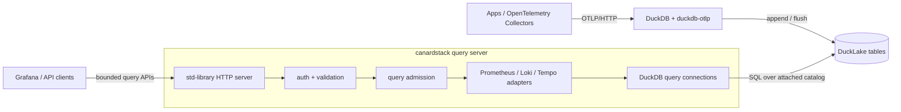

canardstack is one synchronous Rust process backed by DuckDB. It attaches to a
DuckLake catalog that another DuckDB process writes through `duckdb-otlp`, then
serves bounded compatibility query APIs over the visible tables.

The binary does not include OTLP ingest, gRPC, Kafka, ingest durability, table
maintenance, or a bundled DuckLake catalog service. Those concerns belong to
the DuckDB writer process and the catalog deployment chosen around DuckLake.

For a deeper implementation map, use the
[repository architecture docs](https://github.com/smithclay/canardstack/tree/main/docs/architecture).
