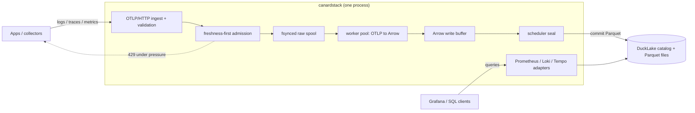

canardstack is one synchronous Rust process backed by one DuckDB process. It
accepts OTLP over HTTP, normalizes telemetry into Arrow record batches, commits
immutable Parquet segments through DuckLake, and serves bounded compatibility
query APIs over the same tables.

For a deeper implementation map, use the
[repository architecture docs](https://github.com/smithclay/canardstack/tree/main/docs/architecture).
