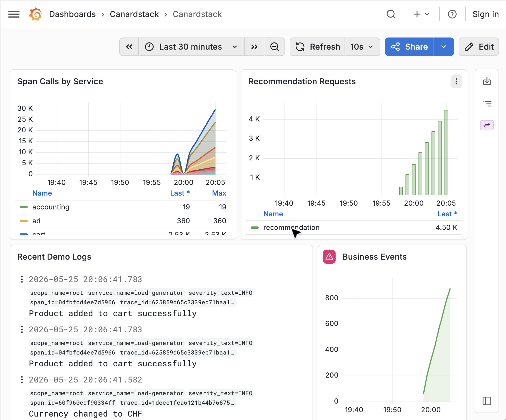

Run canardstack against the full
[OpenTelemetry demo](https://github.com/open-telemetry/opentelemetry-demo) with pre-built Grafana dashboards and data sources.

Keep the otel demo repository in a separate checkout; this repo only supplies the collector
extras file that points the demo collector at canardstack.

## Start canardstack

In the canardstack checkout, start canardstack and the bundled Grafana
datasources:

```bash
cd canardstack
docker compose up canardstack grafana
```

This publishes canardstack on `http://localhost:4318` with the default demo key
`dev-canardstack-key`. Grafana is available on `http://localhost:3000`.
By default, Compose pulls `ghcr.io/smithclay/canardstack:latest`.

To build canardstack from this checkout instead, add the build override:

```bash
docker compose -f compose.yaml -f compose.build.yaml up --build canardstack grafana
```

## Start The OpenTelemetry Demo

In a separate checkout, start the full OpenTelemetry demo without its bundled
observability stack, and mount the canardstack collector extras file:

```bash
git clone https://github.com/open-telemetry/opentelemetry-demo.git ../opentelemetry-demo
cd ../opentelemetry-demo

CANARDSTACK_DIR="$(cd ../canardstack && pwd)"

OTEL_COLLECTOR_CONFIG_EXTRAS="$CANARDSTACK_DIR/config/otel-demo-collector-extras.yml" \
make start-no-o11y
```

`start-no-o11y` skips the demo's Jaeger, Prometheus, OpenSearch, and Grafana
services; use `make start-minimal-no-o11y` for the smaller core-only service
set.

Open the demo storefront:

```text
http://localhost:8080/
```

The demo load generator starts with the stack and sends logs, traces, and
metrics through the demo collector. The checked-in extras file adds an
`otlp_http/canardstack` exporter to the demo's logs, traces, and metrics
pipelines, using OTLP/HTTP protobuf to `http://host.docker.internal:4318`.

## Open Grafana

Open the canardstack Grafana dashboard to see the data:

```text
http://localhost:3000/d/canardstack-overview/canardstack-overview
```

Use `admin/admin` if you log in to the bundled Grafana directly.



## Notes

- `host.docker.internal` works out of the box on Docker Desktop and OrbStack. On
  plain Linux Docker Engine, use an equivalent host-gateway address or add a
  host alias for the demo collector.
- The extras file sends logs, traces, and metrics to canardstack, and keeps the
  metrics receivers to OTLP and spanmetrics for local portability.
