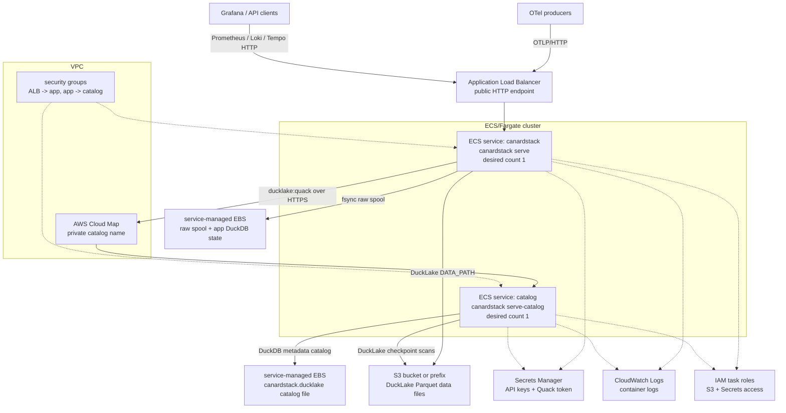

The ECS/Fargate CloudFormation template creates a push-button AWS deployment:

- A public canardstack ECS service behind an Application Load Balancer. The
  container runs `canardstack serve`, so ingest and query APIs are available
  from one service.
- A private catalog ECS service running the same image with
  `canardstack serve-catalog`. It is registered in Cloud Map and serves the
  DuckDB-backed DuckLake metadata catalog over Quack.
- A VPC with two public subnets, internet routing, security groups, and an S3
  bucket or prefix for DuckLake data files.
- A service-managed EBS volume mounted at `/var/lib/canardstack` on each
  service. The app uses its volume for the raw spool and local DuckDB state. The
  catalog uses its volume for the DuckLake metadata DuckDB file.
- Secrets Manager secrets for the canardstack API keys and the Quack token.

S3 Files is intentionally not used for the DuckDB catalog file. The catalog
service uses EBS. The app reaches that catalog over Quack and writes DuckLake
data files to S3.

## Architecture



## Durability notes

ECS service-managed EBS volumes keep this example simple. Validate their
lifecycle behavior against your durability requirements before treating the
template as production.

Both ECS services stay at `DesiredCount: 1`. The app and catalog containers run
as root by default so they can write the root-owned EBS mounts. Override
`AppContainerUser` or `CatalogContainerUser` if your image prepares writable
mount ownership another way.

## Why the template uses regular ECS resources

CloudFormation does not expose the ECS `resourceManagementType` service property
in `AWS::ECS::Service`. The template uses the resources ECS Express Mode creates
and manages underneath: ECS services, Fargate task definitions, security groups,
service-managed EBS volumes, Cloud Map, CloudWatch logs, Secrets Manager, S3,
and IAM roles.

CloudFormation also exposes `AWS::ECS::ExpressGatewayService`, but that resource
only models the primary web container surface. It does not cover the
service-managed EBS mounts canardstack needs for the raw spool and the
DuckDB/Quack catalog metadata file.

## Deploy

`CatalogImage` defaults to the same canardstack image as the app.
`ApiKey`, `AdminApiKey`, and `QuackToken` auto-generate when omitted. The minimal
deploy is:

```bash
aws cloudformation deploy \
  --stack-name canardstack \
  --template-file deploy/aws/ecs-express/template.yaml \
  --capabilities CAPABILITY_IAM
```

Retrieve the generated keys from the stack outputs:

```bash
aws cloudformation describe-stacks --stack-name canardstack \
  --query "Stacks[0].Outputs[?ends_with(OutputKey, 'RetrieveCommand')].OutputValue" \
  --output text
```

Run each printed `aws secretsmanager get-secret-value ...` command to read a
key.

Pass explicit values with `--parameter-overrides`, for example:
`ApiKey=...`, `AdminApiKey=...`, `QuackToken=...`, or `CatalogImage=...`.

Both tasks run on `CpuArchitecture: ARM64` by default. The canardstack image is
multi-arch, so it runs on either Graviton or x86. Pass `CpuArchitecture=X86_64`
to switch.

## Catalog TLS

The catalog container runs `canardstack serve-catalog` with
`CANARDSTACK_CATALOG_TLS_ENABLED=true`. It opens the DuckLake catalog DuckDB file on the
EBS mount, serves it over Quack, and terminates TLS in-binary with a self-signed
certificate on `CatalogPort`, default `9494`. `/healthz` listens on container
port `8080` for the ECS health check.

ECS has no managed TLS for Cloud Map names, and the Quack client assumes HTTPS
for non-local hosts. The app therefore sets
`CANARDSTACK_DUCKLAKE_QUACK_INSECURE_TLS=true` to skip certificate verification
for the catalog URL only. The Quack token authenticates the catalog request, and
TLS still encrypts traffic in transit.

The published canardstack image is built with the `tls` cargo feature.
Override `CatalogImage` only if your image includes that feature or provides the
same TLS behavior another way.

The CloudFormation source lives in
[deploy/aws/ecs-express](https://github.com/smithclay/canardstack/tree/main/deploy/aws/ecs-express).
