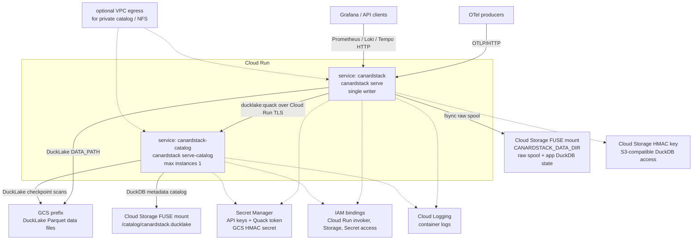

The Cloud Run Terraform module creates two services:

- `canardstack`, the app container. It runs `canardstack serve`, so ingest and
  query compatibility APIs are available from one container.
- `canardstack-catalog`, the catalog container. It runs the same image with
  `canardstack serve-catalog`, serves the DuckDB-backed DuckLake metadata file
  over Quack, and is fixed at one instance.

DuckLake data files live in a GCS prefix. The app service mounts a dedicated GCS
prefix at `/var/lib/canardstack` for `CANARDSTACK_DATA_DIR`, including the raw
spool. The catalog service mounts a separate GCS prefix at `/catalog` for
`canardstack.ducklake`.

## Architecture



## Storage caveat

The default Cloud Run layout is demo-grade.

Both Cloud Run services keep state on Cloud Storage FUSE mounts: the catalog's
`canardstack.ducklake` DuckDB file, plus the app's working DuckDB file and raw
spool under `CANARDSTACK_DATA_DIR`. Cloud Storage FUSE is not a POSIX
filesystem. It lacks byte-range locking and reliable `fsync`, and it does not
support the in-place random writes a live DuckDB database file performs.

That can corrupt the catalog or working DuckDB files. It also weakens the raw
spool durability boundary: a crash can lose requests that already returned
`202`.

For data you care about, put the catalog and `CANARDSTACK_DATA_DIR` on
Filestore/NFS. Cloud Run Gen2 supports NFS volumes. That also means giving the
services VPC access.

## GCS credentials

DuckDB reaches `gcs://` through the S3-compatible interop API. That path uses
HMAC keys. A bare GCP service-account identity is not enough for core DuckDB.

The module creates a `google_storage_hmac_key` for the app service account,
stores the secret half in Secret Manager, and injects the pair into the app as
`AWS_ACCESS_KEY_ID` and `AWS_SECRET_ACCESS_KEY`. DuckDB's credential chain then
works against the `gcs://` `DATA_PATH`.

The key acts as the app service account, which already has
`roles/storage.objectUser` on the bucket. The principal running Terraform,
including the Infrastructure Manager service account, must be allowed to mint
HMAC keys. `roles/storage.admin` or `roles/storage.hmacKeyAdmin` is enough.

## Catalog ingress and TLS

The catalog service defaults to `INGRESS_TRAFFIC_ALL` so the app can reach it
over Cloud Run-managed TLS. Access is gated by
`CANARDSTACK_DUCKLAKE_QUACK_TOKEN`, which `serve-catalog` enforces.

`catalog_invoker_members` defaults to `["allUsers"]` because Quack clients use
the Quack token, not a Google identity token. Cloud Run terminates TLS, so the
app connects over HTTPS and does not set
`CANARDSTACK_DUCKLAKE_QUACK_INSECURE_TLS`.

With those defaults, the catalog endpoint is reachable from the public internet.
The Quack token is the only authentication boundary. Use a long random token.
For anything beyond a demo, prefer a private catalog: set
`catalog_ingress = "INGRESS_TRAFFIC_INTERNAL_ONLY"` and give the app VPC egress
by Direct VPC egress or a Serverless VPC Access connector.

## Deploy with Terraform

```bash
cd deploy/gcp/cloud-run
cp terraform.tfvars.example terraform.tfvars
$EDITOR terraform.tfvars
terraform init
terraform apply
```

By default, the canardstack service has no public invoker binding. Set
`invoker_members = ["allUsers"]` only when you want a public endpoint protected
by `CANARDSTACK_API_KEY` and `CANARDSTACK_ADMIN_API_KEY`.

## Deploy with Infrastructure Manager

```bash
gcloud infra-manager deployments apply projects/PROJECT_ID/locations/us-central1/deployments/canardstack \
  --service-account=projects/PROJECT_ID/serviceAccounts/INFRA_MANAGER_SA@PROJECT_ID.iam.gserviceaccount.com \
  --git-source-repo=https://github.com/<owner>/<repo>.git \
  --git-source-directory=deploy/gcp/cloud-run \
  --git-source-ref=main \
  --input-values=project_id=PROJECT_ID,region=us-central1,api_key=REPLACE_ME,admin_api_key=REPLACE_ME_TOO,quack_token=REPLACE_ME_THREE
```

The Terraform source lives in
[deploy/gcp/cloud-run](https://github.com/smithclay/canardstack/tree/main/deploy/gcp/cloud-run).
