canardstack is one binary. The deploy examples use that binary in two roles:

- `canardstack serve` receives OTLP/HTTP and serves the Prometheus, Loki, and
  Tempo-shaped query APIs.
- `canardstack serve-catalog` serves the DuckLake metadata catalog over Quack.

The app keeps its raw spool and working DuckDB state on a local filesystem. It
talks to the catalog over Quack and writes DuckLake data files to object
storage. Keep both services at one instance unless you are changing the writer
model deliberately.

## Choose a path

| Path | Use it for | Storage shape |
| --- | --- | --- |
| [Local quickstart](/#start-locally) | First run, laptop checks, development | Single process with local DuckLake storage and a loopback Quack catalog endpoint. |
| [Send telemetry](/deployment/send-telemetry/) | Configure OTLP/HTTP producers | OpenTelemetry Collector `otlphttp` exporter to canardstack. |
| [MotherDuck](/deployment/motherduck/) | Fast remote DuckLake experiments | Local app and Grafana, hosted DuckLake catalog through `md:`. |
| [GCP Cloud Run](/deployment/gcp-cloud-run/) | Push-button GCP demo | Cloud Run app and catalog services, GCS DuckLake data files. |
| [AWS ECS/Fargate](/deployment/aws-ecs-fargate/) | Push-button AWS demo | ECS app and catalog services, EBS for local state, S3 DuckLake data files. |

## Shared topology

```mermaid
flowchart TB
  subgraph GCP["GCP Cloud Run"]
    ClientG["OTel producers / Grafana clients"]
    AppG["Cloud Run service: canardstack\ncontainer: canardstack\nserve\nmin=1 max=1"]
    CatalogG["Cloud Run service: catalog\ncontainer: canardstack\nserve-catalog\nmin=1 max=1"]
    AppDataG["GCS-mounted app data volume\nCANARDSTACK_DATA_DIR\nraw spool + local DuckDB state"]
    CatalogFileG["GCS-mounted catalog volume\ncanardstack.ducklake metadata file"]
    DataG["GCS prefix\nDuckLake Parquet data files"]
    SecretsG["Secret Manager\nAPI keys + Quack token"]

    ClientG -->|"OTLP, Prometheus, Loki, Tempo HTTP"| AppG
    AppG -->|"fsync raw spool"| AppDataG
    AppG -->|"DuckLake catalog over Quack"| CatalogG
    CatalogG -->|"DuckDB opens metadata file"| CatalogFileG
    AppG -->|"DuckLake DATA_PATH"| DataG
    AppG -.-> SecretsG
    CatalogG -.-> SecretsG
  end

  subgraph AWS["AWS ECS/Fargate"]
    ClientA["OTel producers / Grafana clients"]
    Alb["Application Load Balancer\nHTTP :80"]
    AppA["ECS service: canardstack\ncontainer: canardstack\nserve\ndesired=1"]
    CatalogA["ECS service: catalog\ncontainer: canardstack\nserve-catalog\nprivate Cloud Map name\ndesired=1"]
    AppDataA["service-managed EBS volume\nCANARDSTACK_DATA_DIR\nraw spool + local DuckDB state"]
    CatalogFileA["service-managed EBS volume\ncanardstack.ducklake metadata file"]
    DataA["S3 prefix\nDuckLake Parquet data files"]
    SecretsA["Secrets Manager\nAPI keys + Quack token"]

    ClientA --> Alb
    Alb -->|"target :4318"| AppA
    AppA -->|"fsync raw spool"| AppDataA
    AppA -->|"DuckLake catalog over Quack"| CatalogA
    CatalogA -->|"DuckDB opens metadata file"| CatalogFileA
    AppA -->|"DuckLake DATA_PATH"| DataA
    AppA -.-> SecretsA
    CatalogA -.-> SecretsA
  end
```

## Common settings

`CANARDSTACK_DUCKLAKE_ATTACH_URI` points the app at a DuckLake catalog. In the
cloud examples it is a Quack URI such as
`ducklake:quack:catalog.internal:443`. With MotherDuck it is an `md:` URI.

`CANARDSTACK_DUCKLAKE_DATA_PATH` points DuckLake at object storage for Parquet
data files, such as `gcs://bucket/prefix/` or `s3://bucket/prefix/`. It is not
used for the MotherDuck quick path shown here.

`CANARDSTACK_DUCKLAKE_QUACK_TOKEN` is shared by the app and the catalog service.
Treat it as a secret. Quack is the catalog authentication boundary in these
examples.

`CANARDSTACK_DUCKLAKE_CATALOG_PATH` belongs on the catalog service. Do not set it
on the app when the app attaches to a remote Quack catalog.

`CANARDSTACK_DUCKLAKE_QUACK_INSECURE_TLS` is used only where the catalog service
terminates TLS with the in-binary self-signed TLS shim. The AWS example needs it
because ECS Cloud Map names do not have managed TLS. Cloud Run does not need it
because Cloud Run terminates TLS with a managed certificate.

`CANARDSTACK_POSTGRES_DSN` stays unset in these examples.

## Deployment artifacts

The deploy source files stay in the repository:

- [GCP Cloud Run Terraform](https://github.com/smithclay/canardstack/tree/main/deploy/gcp/cloud-run)
- [AWS ECS/Fargate CloudFormation](https://github.com/smithclay/canardstack/tree/main/deploy/aws/ecs-express)

Those directories contain the runnable artifacts. These docs are the operator
guide for using them.
