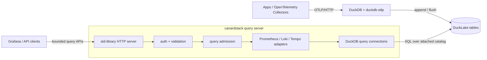

canardstack is one synchronous Rust process backed by DuckDB. It attaches to a
DuckLake catalog that another DuckDB process writes through `duckdb-otlp`, then
serves bounded compatibility query APIs over the visible tables.

The query-only boundary keeps canardstack small and predictable. Ingest,
durability, catalog serving, and table maintenance belong to the DuckDB writer
process and the catalog deployment chosen around DuckLake. canardstack only
needs to attach the catalog, validate the schema version, and run bounded reads.

This split also makes the compatibility APIs intentionally conservative.
Prometheus, Loki, and Tempo clients expect interactive queries, but DuckLake is
the durable storage layer. canardstack therefore favors explicit time ranges,
row limits, request timeouts, memory limits, and query admission over broad
unbounded query semantics.

Direct SQL remains outside the HTTP API. Use DuckDB, MotherDuck, or another SQL
client when you need ad hoc analysis over the tables.

For a deeper implementation map, use the
[repository architecture docs](https://github.com/smithclay/canardstack/tree/main/docs/architecture).
